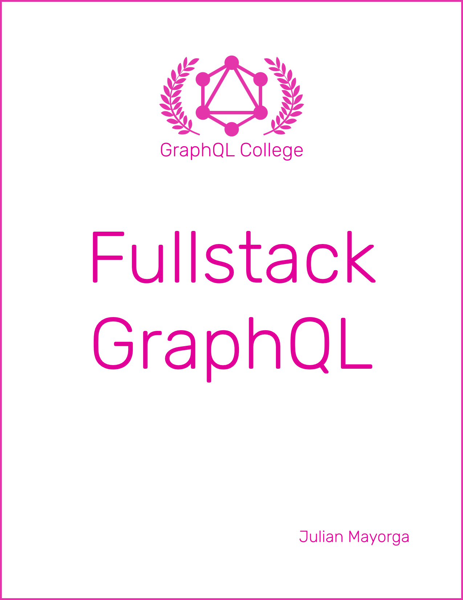

# Fullstack GraphQL

An open source book about full stack GraphQL development with React and Node.

<a href="https://graphql.college/fullstack-graphql">https://graphql.college/fullstack-graphql</a>.

## Structure

Each chapter is written in a markdown file in the `manuscript` folder.

Every image in the book is located in `manuscript/images`.

The order of the chapters is determined by the `Book.txt` file.

`Sample.txt` defines the content of the book's sample chapter.

## Contributing

All types of contributions are welcome! Here is a little guide on how to contribute.

### Bugs/Typos

If you see a bug or typo please open a github issue.

### Fixes

To contribute with code fixes, please remix the example on Glitch and create a Pull Request referencing the fix's Glitch URL.

### New chapters

Please file an issue to suggest new chapters. Chapter suggestions are always welcome! But please don't create a PR with a new chapter before discussing about it, because it may not get accepted. Your time is golden, use it well!

### Questions

If you have any questions regarding the book, or GraphQL in general, please create a new conversation in https://spectrum.chat/graphql instead of a Github issue.

## License

This book is licensed under a [Creative Commons Attribution Non Commercial Share Alike 4.0 International](https://creativecommons.org/licenses/by-nc-sa/4.0/) license.
