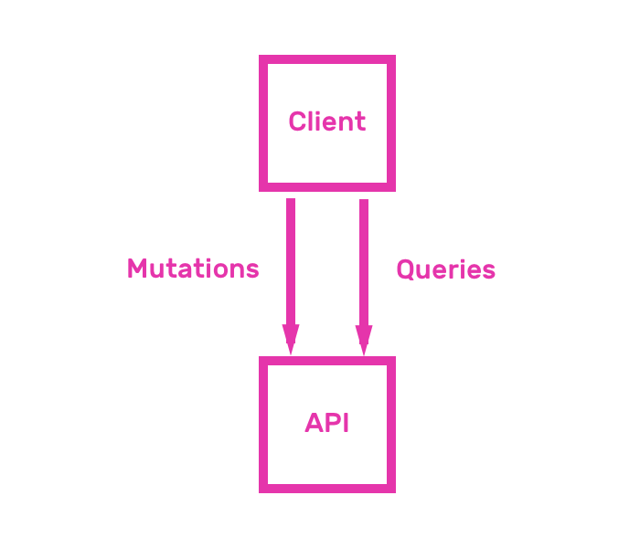

## Reading and writing data

In this chapter you will learn how to use GraphQL from a frontend developer's perspective. This chapter explains how to use queries and mutations to read and write data from GraphQL.



As you continue to learn the ins and outs of GraphQL, you will realize that it is a technology that makes life much easier for frontend developers. It gives them complete control of the data that they want from the server.

Making life easier for clients has been one of the main goals for the team that created GraphQL. The evolution of the language has been the result of [Client-Driven development](https://youtu.be/vQkGO5q52uE).

### Queries and Mutations

In its simplest form, GraphQL is all about asking for specific fields of objects.

You will learn the GraphQL query language, that defines how to interact with data using GraphQL's queries and mutations. Queries let you ask for data, whereas Mutations let you write data. Queries serve the same purpose as REST's GET requests, and you could think of mutations as analogies to REST's POST, PUT, PATCH and DELETE requests.

The rest of this chapter will teach you the following features of GraphQL syntax:

* Basic query
* Query nested fields
* Query multiple fields
* Operation name
* Arguments
* Aliases
* Fragments
* Variables
* Directives
* Default variables
* Mutations
* Inline fragments
* Meta fields

All concepts that you will learn have a runnable example, implemented using `graphql-js`. GraphQL JS is the reference implementation of GraphQL, built with Javascript. This library exports a function called `graphql` which lets us send a query to a GraphQL schema.

The examples in this chapter contain a sample GraphQL schema. Don't worry if you don't understand it yet. We will focus on the querying part in this chapter, while the next one will focus on how to create the schema. Please note that this schema returns mock data, so don't expect much more than random numbers or a bunch of `"Hello world"`. The next chapter will teach you how to design this schema properly.

Even though GraphQL is meant to be exposed by an HTTP server and consumed by an HTTP client, running GraphQL queries using Javascript will help you understand the basics of the language, without any overhead.

You will use a function called `graphql`, which `graphql-js` exports. The main use case of this function receives two arguments and returns a promise. The first argument is an object that represents a GraphQL schema. The second argument is a string containing a GraphQL query. All examples in this chapter will teach you how to write this query string. Please refer to the [API documentation of `graphql-js`](http://graphql.org/graphql-js/graphql/#graphql) to know more about it.

```js
const { graphql } = require("graphql");

const schema = require("../schema");

const query = ``;

graphql(schema, query).then(result =>
  console.log(JSON.stringify(result, null, 1))
);
```

Remix this example on glitch to run all the queries in this chapter. Remixing means creating your own copy of a project. This will give you complete freedom over the project. You can modify it at will, run scripts using a console, and even export it to github.

<a href="https://glitch.com/edit/#!/remix/pinapp-queries-mutations">
  
</a>

Once you have remixed this project, you can run any of the scripts in the `queries` folder. Try it out by opening the URL of your remixed project. After you open it, open its console by clicking "Logs" and then "Console". Run `node queries/1-query.js` to see the output of the first script.

You have everything you need to start learning GraphQL query syntax. Let's start by sending basic queries.

### Query

As we said at the start of this chapter, GraphQL is all about asking for specific fields of objects. A query defines which fields the GraphQL JSON response will have. The syntax for achieving this looks similar to writing a JSON object with just the keys, excluding the values. For example, if you wanted to get a list of users, each one with an email field, you could write the following query:

```graphql
{
  users {
    email
  }
}
```

You can send the previous query along with the example schema to the `graphql` function. Remember, the second argument that `graphql` receives is a query string. Let's see an example script.

`queries/1-query.js`

```js
const { graphql } = require("graphql");

const schema = require("../schema");

const query = `
  {
    users {
      email
    }
  }
`;

graphql(schema, query).then(result =>
  console.log(JSON.stringify(result, null, 1))
);
```

Running the previous script in the console returns a response that has all the fields that you asked for in the query, plus it has a top level `"data"` key. Inside that key, you will see a structure that matches exactly the query that we sent. It has a `"users"` key, which contains an array of objects with an `"email"` key.

```bash
$ node queries/1-query.js
{
 "data": {
  "users": [
   {
    "email": "Hello World"
   },
   {
    "email": "Hello World"
   }
  ]
 }
}
```

### Nested Fields

You can query nested fields using GraphQL. One of the great advantages of GraphQL over REST is fetching nested resources in a single query. You can ask for a resource, for example users, and a list of nested resources, for example pins, in a single query. In order to do that with REST, you would have to get users and pins in separate HTTP requests.

Note that only fields with `Object` type can have nested fields. You can't ask for nested fields in other types, like `String`, `Int` or others.

```js
const { graphql } = require("graphql");

const schema = require("../schema");

const query = `
  {
    users {
      email
      pins {
        title
      }
    }
  }
`;

graphql(schema, query).then(result =>
  console.log(JSON.stringify(result, null, 1))
);
```

The above example shows how simple it is asking for nested resources. As you can imagine, running the previous example returns a JSON object with the exact keys that the query specifies. Try it out by running `node queries/2-fields.js` in your project's console.

```bash
$ node queries/2-fields.js
{
 "data": {
  "users": [
   {
    "email": "Hello World",
    "pins": [
     {
      "title": "Hello World"
     },
     {
      "title": "Hello World"
     }
    ]
   },
   {
    "email": "Hello World",
    "pins": [
     {
      "title": "Hello World"
     },
     {
      "title": "Hello World"
     }
    ]
   }
  ]
 }
}
```

### Multiple fields

GraphQL allows you to query for multiple fields in a single query. You saw in the previous example that you can query nested resources, well you can also query for totally unrelated resources in the same operation.

```js
const { graphql } = require("graphql");

const schema = require("../schema");

const query = `
  {
    users {
      email
    }
    pins {
      title
    }
  }
`;

graphql(schema, query).then(result =>
  console.log(JSON.stringify(result, null, 1))
);
```

Now you are starting to see that GraphQL queries are really about asking for specific fields of objects. If you run `node queries/3-multiple-fields.js`, you will get an object with two keys, `users` and `pins`.

```bash
$ node queries/3-multiple-fields.js
{
 "data": {
  "users": [
   {
    "email": "Hello World"
   },
   {
    "email": "Hello World"
   }
  ],
  "pins": [
   {
    "title": "Hello World"
   },
   {
    "title": "Hello World"
   }
  ]
 }
}
```

### Operation name

Up until this point, you were using the short hand syntax of GraphQL queries, but there is also a longer syntax that gives you more options. The longer syntax includes the `query` keyword, and the operation name. Many times you will need to use this syntax because it allows you to specify variables, or use different operations like mutations or subscriptions, which we will cover in the rest of the book.

This is how a query with the operation name `GetUsers` looks like:

```js
const { graphql } = require("graphql");

const schema = require("../schema");

const query = `
  query GetUsers {
    users {
      email
      pins {
        title
      }
    }
  }
`;

graphql(schema, query).then(result =>
  console.log(JSON.stringify(result, null, 1))
);
```

You can run the previous query by entering `node queries/4-operation-name.js` in the console. Notice that it behaves exactly like the short hand version of the query.

```bash
$ node queries/4-operation-name.js
{
 "data": {
  "users": [
   {
    "email": "Hello World",
    "pins": [
     {
      "title": "Hello World"
     },
     {
      "title": "Hello World"
     }
    ]
   },
   {
    "email": "Hello World",
    "pins": [
     {
      "title": "Hello World"
     },
     {
      "title": "Hello World"
     }
    ]
   }
  ]
 }
}
```

### Arguments

All fields can have arguments, which you can use the same way you would use function arguments. You could think of GraphQL fields as functions, more so than properties. Picturing them as functions provides a clearer picture regarding what you can do by passing arguments to them.

Let's say for example that you want to query a pin by id by querying a field called `pinById`. You could ask for the pin with id 1 by passing a named argument to the query, like this:

```js
const { graphql } = require("graphql");

const schema = require("../schema");

const query = `
  query {
    pinById(id: "1") {
      title
    }
  }
`;

graphql(schema, query).then(result =>
  console.log(JSON.stringify(result, null, 1))
);
```

Running `node queries/5-arguments.js` in the console yields the following output.

```bash
$ node queries/5-arguments.js
{
 "data": {
  "pinById": {
   "title": "Hello World"
  }
 }
}
```

### Aliases

What happens if you want to query the same field twice in a single query? Well you can achieve that using aliases. Aliases let you associate a name to a field, so that the response will have the alias you specified instead of the key name.

Aliasing a field is as simple as prepending the field name with the desired alias and a colon (:).

Aliases are especially helpful when querying for the same field but with different arguments. The following query asks for `pinById` twice, aliasing the first field with `firstPin` and the second field with `secondPin`.

```js
const { graphql } = require("graphql");

const schema = require("../schema");

const query = `
  query {
    firstPin: pinById(id: "1") {
      title
    }
    secondPin: pinById(id: "2") {
      title
    }
  }
`;

graphql(schema, query).then(result =>
  console.log(JSON.stringify(result, null, 1))
);
```

The response contains the aliases instead of the field name. Verify this by running `node queries/6-aliases.js`.

```bash
$ node queries/6-aliases.js
{
 "data": {
  "firstPin": {
   "title": "Hello World"
  },
  "secondPin": {
   "title": "Hello World"
  }
 }
}
```

### Fragments

GraphQL syntax provides a way to reuse a set of fields with the `fragment` keyword. This is a language designed for querying fields, so it seems natural to have a way to reuse fields in different parts of the query.

In order to reuse fields you have to first define a fragment and then place the fragment in different parts of the query.

Define fragments using the `fragment [fragmentName] on [Type] { field anotherField }` syntax. Use fragments by placing `...[fragmentName]` anywhere you would place a field.

An example is worth more than 1000 keywords. The following example defines a fragment called `pinFields`, and uses it twice in the query.

```js
const { graphql } = require("graphql");

const schema = require("../schema");

const query = `
  query {
    pins {
      ...pinFields
    }
    users {
      email
      pins {
        ...pinFields
      }
    }
  }
  fragment pinFields on Pin {
    title
  }
`;

graphql(schema, query).then(result =>
  console.log(JSON.stringify(result, null, 1))
);
```

Run the previous query with `node queries/7-fragments.js`. Play with the defined fragment by changing the list of fields that you ask for, and see how that changes the output of the script.

```bash
$ node queries/7-fragments.js
{
 "data": {
  "pins": [
   {
    "title": "Hello World"
   },
   {
    "title": "Hello World"
   }
  ],
  "users": [
   {
    "email": "Hello World",
    "pins": [
     {
      "title": "Hello World"
     },
     {
      "title": "Hello World"
     }
    ]
   },
   {
    "email": "Hello World",
    "pins": [
     {
      "title": "Hello World"
     },
     {
      "title": "Hello World"
     }
    ]
   }
  ]
 }
}
```

### Variables

Just like fragments lets you reuse field sets, variables let you reuse queries. Using variables you can specify which parts of the query are configurable, so that you can use the query multiple times by changing the variable values. Using variables you can construct dynamic queries.

You can add a list of variables names, along with their types, in the same place that you specify the `query` keyword.

Let's see how you could add variables to the example of querying pins by id. You could define a variable called `$id`, specify its type as `String` and mark it as required by putting an exclamation mark (!) after its type.

The next snippet defines the `$id` variable in its query, and sends it along with the schema and a list of variables to `graphql`. This `graphql` function receives a list of variables as its fifth argument.

```js
const { graphql } = require("graphql");

const schema = require("../schema");

const query = `
  query ($id: String!) {
    pinById(id: $id) {
      title
    }
  }
`;

graphql(schema, query, undefined, undefined, {
  id: "1"
}).then(result => console.log(JSON.stringify(result, null, 1)));
```

The result of running `node queries/8-variables.js` is pretty straightforward.

```bash
$ node queries/8-variables.js
{
 "data": {
  "pinById": {
   "title": "Hello World"
  }
 }
}
```

### Directives

Just as variables let you create dynamic queries by changing arguments, directives allow you to construct dynamic queries that modify the structure and shape of their result.

You can attach directives to fields or fragments. All directives start with an `@` symbol.

GraphQL servers can expose any number of directives that they wish, but the GraphQL spec defined two mandatory directives, `@include(if: Boolean)` and `@skip(if: Boolean)`. The first includes a field only when `if` is true, and the second skips a field when `if` is true.

The next example shows directives in action. It places an `@include` directive on the `pins` field, and parameterizes the value using a variable called `$withPins`.

```js
const { graphql } = require("graphql");

const schema = require("../schema");

const query = `
  query ($withPins: Boolean!) {
    users {
      email
      pins @include(if: $withPins) {
        title
      }
    }
  }
`;

graphql(schema, query, undefined, undefined, {
  withPins: true
}).then(result => console.log(JSON.stringify(result, null, 1)));
```

Go ahead and run the previous example with `node queries/9-directives.js`. Change `withPins` to false and see how the result's structure changes.

```bash
$ node queries/9-directives.js
{
 "data": {
  "users": [
   {
    "email": "Hello World",
    "pins": [
     {
      "title": "Hello World"
     },
     {
      "title": "Hello World"
     }
    ]
   },
   {
    "email": "Hello World",
    "pins": [
     {
      "title": "Hello World"
     },
     {
      "title": "Hello World"
     }
    ]
   }
  ]
 }
}
```

### Default variables

GraphQL syntax lets you define default values to variables. You can achieve this by adding an equals sign (=) after the variable's type.

Let's see an example by adding a default parameter of `true` to the previous Directives example. A default variable allows you to call `graphql` in the example without sending `withPins` in the list of variables.

```js
const { graphql } = require("graphql");

const schema = require("../schema");

const query = `
  query ($withPins: Boolean = true) {
    users {
      email
      pins @include(if: $withPins) {
        title
      }
    }
  }
`;

graphql(schema, query).then(result =>
  console.log(JSON.stringify(result, null, 1))
);
```

Run `node queries/10-default-variables.js`. Notice that the output looks exactly the same as calling `graphql` with a `withPins` value of `true`.

```bash
$ node queries/10-default-variables.js
{
 "data": {
  "users": [
   {
    "email": "Hello World",
    "pins": [
     {
      "title": "Hello World"
     },
     {
      "title": "Hello World"
     }
    ]
   },
   {
    "email": "Hello World",
    "pins": [
     {
      "title": "Hello World"
     },
     {
      "title": "Hello World"
     }
    ]
   }
  ]
 }
}
```

### Inline fragments

Inline fragments provide a way to specify a list of fields inline. As opposed to regular fragments, which must be defined using the `fragment` keyword, inline fragments don't need to be defined anywhere.

These types of fragments are useful when querying fields with a `Union` or `Interface` type. These fields can return objects with varying fields, depending on the object's type. You can use fragments to indicate which fields to return, based on an object's type.

A great use case for inline fragments is a search query, which can return objects of different types. The following snippet shows how you could use inline fragments to get a different set of fields from a `search` query. If the returned object is a `Person`, return its `email`, and if this object is a `Pin`, return its `title`.

```js
const { graphql } = require("graphql");

const schema = require("../schema");

const query = `
  query ($text: String!) {
    search(text: $text) {
      ... on Person {
        email
      }
      ... on Pin {
        title
      }
    }
  }
`;

graphql(schema, query, undefined, undefined, {
  text: "Hello world"
}).then(result => console.log(JSON.stringify(result, null, 1)));
```

Run the previous example with `node queries/11-inline-fragments.js`.

```bash
$ node queries/11-inline-fragments.js
{
 "data": {
  "search": [
   {
    "title": "Hello World"
   },
   {
    "email": "Hello World"
   }
  ]
 }
}
```

### Meta fields

Queries can request meta fields, which are special fields that contain information about a schema.

GraphQL allows you to retrieve the type name of objects by requesting a meta field called `__typename`.

This meta field is useful in the same scenarios where inline fragments are handy, which is in queries that can return multiple field types, like `Union` or `Interface`.

The following snippet adds a `__typename` field to the example `search` query from the inline fragments explanation.

```js
const { graphql } = require("graphql");

const schema = require("../schema");

const query = `
  query ($text: String!) {
    search(text: $text) {
      __typename
      ... on Person {
        email
      }
      ... on Pin {
        title
      }
    }
  }
`;

graphql(schema, query, undefined, undefined, {
  text: "Hello world"
}).then(result => console.log(JSON.stringify(result, null, 1)));
```

Run the previous script by entering `node queries/12-meta-fields.js` into the console. You will see that the response contains a `__typename` field in each object.

```bash
$ node queries/12-meta-fields.js
{
 "data": {
  "search": [
   {
    "__typename": "Admin",
    "email": "Hello World"
   },
   {
    "__typename": "Pin",
    "title": "Hello World"
   }
  ]
 }
}
```

### Mutations

GraphQL syntax provides a way to create data with the `mutation` keyword. It works similarly to the `query` keyword. It supports variables, you can ask for specific fields in the response, and all the other features that we have talked about. As opposed to queries, mutations don't have shorthand forms, this means that they always start with the `mutation` keyword.

Even though mutations signify data changes, this is merely a convention. There is nothing that enforces that servers actually change data inside mutations. Similarly, there is nothing enforcing that queries don't contain any data changes. This convention is similar to the REST conventions that recommend GET requests to not have any side effects, or POST requests to create resources. It is not enforced in any way, but you should follow in order to not send any unexpected surprises to your API consumers.

Let's see how mutations work in practice by sending a mutation called `addPin`, exposed by the example schema we were using in this chapter.

You will notice that writing mutations is really similar to writing queries. The only differences are the initial keyword and the fact that it signifies a data change.

```js
const { graphql } = require("graphql");

const schema = require("../schema");

const query = `
  mutation AddPin($pin: PinInput!) {
    addPin(pin: $pin) {
      id
      title
      link
      image
    }
  }
`;

graphql(schema, query, undefined, undefined, {
  pin: {
    title: "Hello world",
    link: "Hello world",
    image: "Hello world"
  }
}).then(result => console.log(JSON.stringify(result, null, 1)));
```

Run this mutation example by entering `node queries/13-mutations.js` in the console. Remember that our schema works with mocked data, it does not have a real implementation underneath, so don't expect any data changes caused by this mutation.

```bash
$ node queries/13-mutations.js
{
 "data": {
  "addPin": {
   "id": "Hello World",
   "title": "Hello World",
   "link": "Hello World",
   "image": "Hello World"
  }
 }
}
```

Your last mutation did not generate any data because it goes against a mocked schema. You will design this schema from scratch and implement a working version of it in the next chapter, called Data modeling.
