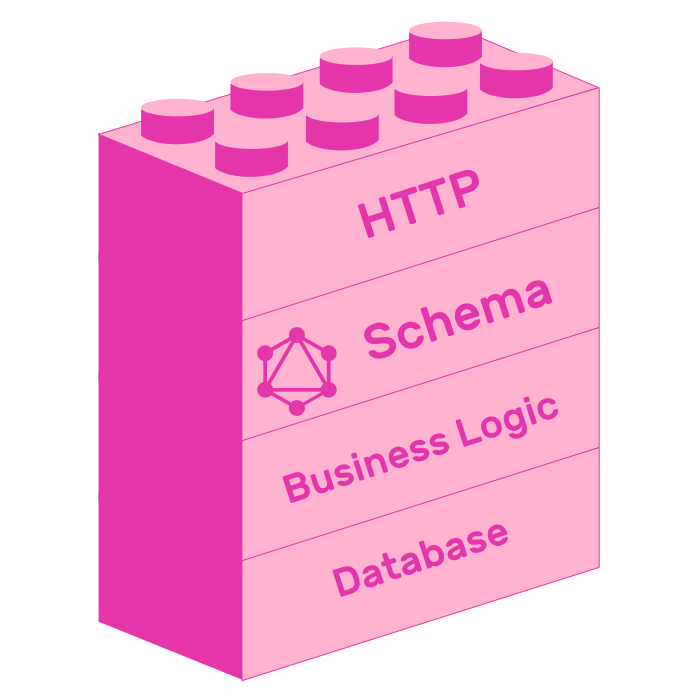
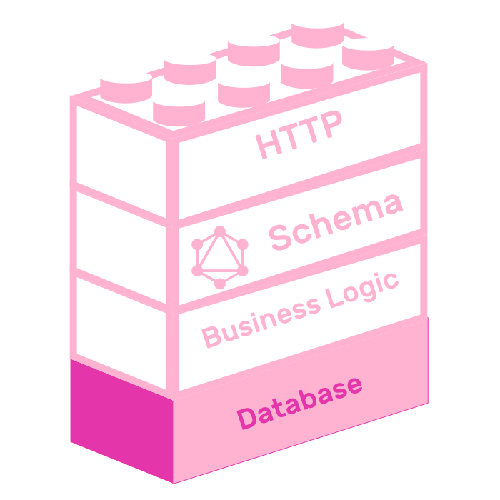
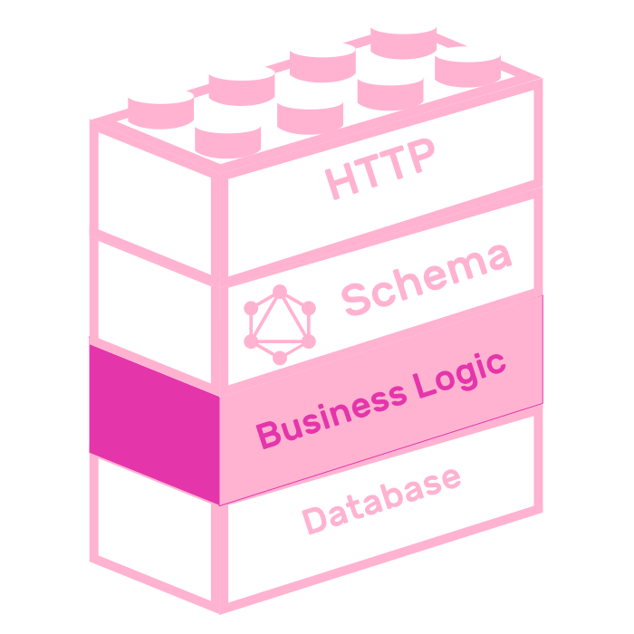

## 3. GraphQL APIs

The most common way of exposing a GraphQL schema is with an HTTP server. Building GraphQL APIs is much more than just designing schemas. This chapter will teach you how to create robust, layered GraphQL APIs.


You will learn how to expose GraphQL schemas using Apollo Server. How to connect your resolvers to a database. You will add email based authentication to your API. Finally you will learn how to organize your source code based on features.



All stages in this chapter have a corresponding project, which you can remix to learn by practice.

Let's start by learning how to create an API using Apollo Server.

### 3.1 Server

Apollo Server is an open source, spec-compliant GraphQL server. It is a production-ready, easy to setup way of exposing GraphQL schemas, so HTTP clients can consume them.


You already created a schema using `graphql-tools` in the previous chapter, so exposing it with Apollo Server is really straightforward.

```js
const { ApolloServer } = require("apollo-server");

const schema = require("./schema");

const server = new ApolloServer({ schema });

server.listen().then(({ url }) => {
  console.log(`🚀  Server ready at ${url}`);
});
```

That's really it! With just a call to `server.listen()` you have a live GraphQL API. Remix the following example project to create your own copy.

[](https://glitch.com/edit/#!/remix/pinapp-server)

Click the Show button, on the top left of the screen, to open a batteries included GraphQL client called [GraphQL Playground](https://github.com/prismagraphql/graphql-playground). It is more than just a GraphQL client, it almost feels like an IDE. It has query autocomplete, it has GraphQL schema documentation and it stores all your queries so you can reuse them later.


Now that you have deployed your GraphQL API, it's time to add persistence using a database.

### 3.2 Database

GraphQL APIs can be backed up by any data source. They can use SQL databases, NoSQL, in-memory databases or even use HTTP endpoints.



In this chapter you will connect PinApp to a SQLite database using a database connector called [Knex](http://knexjs.org). Knex is a SQL query builder that can communicate with many SQL databases, like SQLite3, MySQL, Postgres and more.

Remix the current iteration of PinApp so you can follow along the contents of this section with your own copy of the project.

<a href="https://glitch.com/edit/#!/remix/pinapp-database">
  
</a>

> Remember to follow the getting started instructions on the project's README

Since all database related interactions happen in `resolvers.js`, let's start with the contents of that file.

Retrieve a set of records using `select()`. For example this is how to get the list of pins.

```js
pins: () => database("pins").select(),
```

You can chain together Knex functions. For example you can filter results from a `select()` by chaining its call with the `where()` function.

```js
search: (_, { text }) => {
  return Promise.all([
    database("users")
      .select()
      .where("email", "like", `%${text}%`),
    database("pins")
      .select()
      .where("title", "like", `%${text}%`)
  ]);
};
```

Another useful function that knex provides is `insert()`. It allows you to create objects in your database. This is how the `addPin` mutation looks like using `insert`.

```js
addPin: async (_, { pin }, { token }) => {
  const [user] = await authorize(token);
  const { user: updatedUser, pin: createdPin } = await addPin(user, pin);
  await database("pins").insert(createdPin);
  return createdPin;
},
```

The file called `database.js` instantiates an instance of knex and exports it as a module. It is a simple file that creates a knex instance with configuration values from a file called `knexfile.js`.

```js
const database = require("knex")(require("./knexfile"));

module.exports = database;
```

Knex provides a CLI which provides several utilities for creating migrations, seeding databases, and more. It reads configuration from `knexfile.js`. PinApp's configuration file looks like this:

```js
module.exports = {
  client: "sqlite3",
  connection: {
    filename: ".data/database.sqlite"
  }
};
```

> [Glitch](https://glitch.com) allows you to persist data inside the `.data` folder. This is why `database.sqlite` is located in that folder.

The final step you need in order to use a SQL file is to generate your database schema. Knex allows you to generate migration files using its CLI.

Running `npx knex migrate:make create_users_table` creates a file called `[date]_create_users_table.js` inside the `.migrations` folder. This file exports two methods, `up` and `down`. These files are placeholders, which you need to fill in with your specific needs. In this case, the user table needs to have two fields, `id` and `email`. Both will have type `string`. The `id` field will be a primary key.

```js
exports.up = function(knex) {
  return knex.schema.createTable("users", function(table) {
    table.string("id").primary();
    table.string("email");
  });
};

exports.down = function(knex) {
  return knex.schema.dropTable("users");
};
```

There is another migration in the project you remixed, called `[date]_create_pins_migration`. It defines five `string` fields: `id`, `title`, `link`, `image` and `pin_id`.

```js
exports.up = function(knex) {
  return knex.schema.createTable("pins", function(table) {
    table.string("id").primary();
    table.string("title");
    table.string("link");
    table.string("image");
    table
      .string("user_id")
      .references("id")
      .inTable("users")
      .onDelete("CASCADE")
      .onUpdate("CASCADE");
  });
};

exports.down = function(knex) {
  return knex.schema.dropTable("pins");
};
```

Running `npm run setup-db` will apply all database migrations. This script is defined in the `scripts` key of `package.json`:

```json
"setup-db": "knex migrate:latest"`
```

Teaching SQL is outside of the scope of this book, it needs a book on its own if you want to properly learn it. Knex does a great job at interacting with SQL databases for Javascript users, and it has great [documentation](http://knexjs.org). Refer to it if you want to learn more about it.

### 3.3 Authentication

A common question when building GraphQL APIs is "Where to put authentication and authorization?". Should it be in the GraphQL layer? Database layer? Business logic? Even though the answer depends on the context of what API you are building, a common way to solve this problem is to put authentication and authorization in the business layer. Putting auth related code in the business layer is [Facebook's approach](https://dev-blog.apollodata.com/graphql-at-facebook-by-dan-schafer-38d65ef075af).



You can implement auth in several ways, that is entirely up to your needs. This section will teach you how to add email based authentication to PinApp.

Email based authentication consists of providing an email input to your users. Once they submit their email, you send them an authentication token inside a link to your app. If they enter your app using a valid token, you can trust this user. Once they enter your site with a valid token, you exchange that temporary token with a token with a longer expiration date.

The biggest advantage of this authentication system, as opposed to good old password-based authentication, is that you don't need to deal with passwords at all. Deciding not to store passwords means you don't have to take extreme security measures to keep them safe. It also means that your users don't have to deal with yet another site that asks them to create a new password.

```gherkin
Feature: Email based authentication

  Scenario: Send magic link
    Given a user enters his email address
    When he/she submits the form
    Then he/she should receive an email with a link to the app that contains his token

  Scenario: Verify email
    Given a user receives an email with a magic link
    When he/she clicks the link
    Then he/she should see a loading screen
    When the app verifies the token
    Then he/she should see an email confirmation message
```

Speaking of GraphQL terms, both of these actions are mapped onto mutations in their corresponding GraphQL schema, called `sendShortLivedToken` and `createLongLivedToken`. The first action receives an email as argument, which is of type `String`. The second action receives a token and returns the new token.

```graphql
type Mutation {
  # ...
  sendShortLivedToken(email: String!): Boolean
  createLongLivedToken(token: String!): String
}
```

Remix this project so you can follow the implementation of email based auth.

[](https://glitch.com/edit/#!/remix/pinapp-email-authentication)

Now let's analyze how the email-related resolvers look like.

The resolver for `sendShortLivedToken` should check if the user that corresponds to the email exists. If it doesn't exist, then it should insert it into the database. After this, it should create a token with a short expiration time, and send it to the user's email.

```js
sendShortLivedToken: async (_, { email }) => {
  let user;
  const userExists = await database("users")
    .select()
    .where({ email });
  if (userExists.length) {
    user = userExists[0];
  } else {
    user = createUser(email);
    await database("users").insert(user);
  }
  const token = createShortLivedToken(user);
  return sendShortLivedToken(email, token);
};
```

This resolver uses two functions from `business-logic.js`, `createShortLivedToken` and `sendShortLivedToken`.

The first one creates a token using the `jsonwebtoken` NPM package's [`sign`](https://github.com/auth0/node-jsonwebtoken#jwtsignpayload-secretorprivatekey-options-callback) function. This token will have an expiration time of five minutes.

```js
const createShortLivedToken = ({ email, id }) => {
  return jsonwebtoken.sign({ id, email }, process.env.SECRET, { expiresIn: "5m" });
}
```

The second function, `sendShortLivedToken`, uses a function defined in `email.js` called `sendMail`.

```js
const sendShortLivedToken = (email, token) => {
  return sendMail({
    from: '"Julian" <julian@graphql.college>',
    to: email,
    text: `${process.env.APP_URL}/verify?token=${token}`,
    html: `<a href="${process.env.APP_URL}/verify?token=${token}" target="_blank">Authenticate</a>`,
    subject: "Auth token"
  });
}
```

To send mails, you will use the `nodemailer` package. This library allows you to send emails through an SMTP server. The easiest way to create an email server for development purposes is with [Ethereal](https://ethereal.email/messages). This is a fake email service developed by the creators of Nodemailer, and it is a super easy way to create dev SMTP services. Of course, if you want to send actual emails, you should use a real SMTP service. [Sendgrid](https://sendgrid.com/) has a great free plan.

```js
const nodemailer = require('nodemailer');

const transporter = nodemailer.createTransport({
  host: 'smtp.ethereal.email',
  port: 587,
  auth: {
    user: process.env.MAIL_USER,
    pass: process.env.MAIL_PASSWORD
  }
});

function sendMail({ from, to, subject, text, html }) {
  const mailOptions = {
    from,
    to,
    subject,
    text,
    html
  };
  return new Promise((resolve, reject) => {
    transporter.sendMail(mailOptions, (error, info) => {
      if (error) {
        return reject(error);
      }
      resolve(info);
    });
  });
}

module.exports = sendMail;
```

The implementation of `createLongLivedToken` is much simpler than `sendShortLivedToken`. It uses a function from `business-logic.js` that verifies the token it receives as argument. If that token is valid, it creates a token with an expiration date of thirty days.

```js
const createLongLivedToken = token => {
  try {
    const { id, email } = jsonwebtoken.verify(token, process.env.SECRET);
    const longLivedToken = jsonwebtoken.sign({ id, email }, process.env.SECRET, { expiresIn: "30 days" });
    return Promise.resolve(longLivedToken);
  } catch(error) {
    console.error(error);
    throw error;
  }
}
```

Go ahead and configure your remixed project with your Ethereal account. Once you have setup everything, hop into GraphQL Playground by clicking the "Show" button and authenticate using your email (or any email actually, Ethereal intercepts all of them :D).

### 3.4 File organization

* https://glitch.com/edit/#!/pinapp-files

### 3.5 Summary

