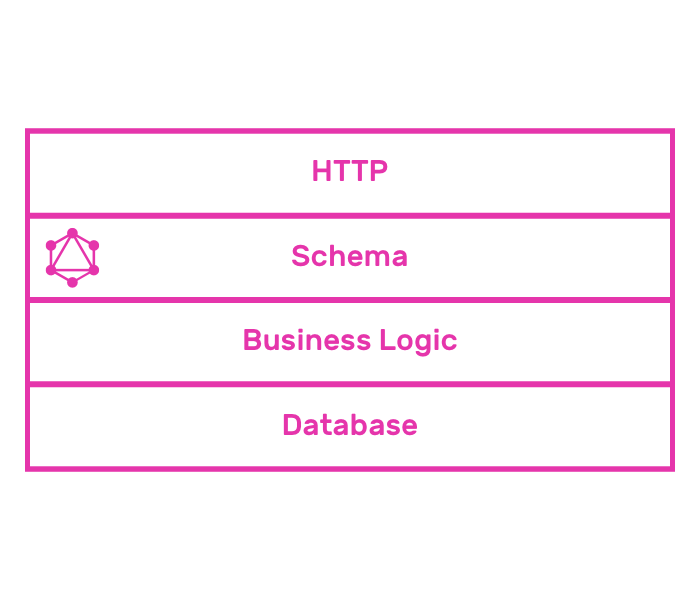
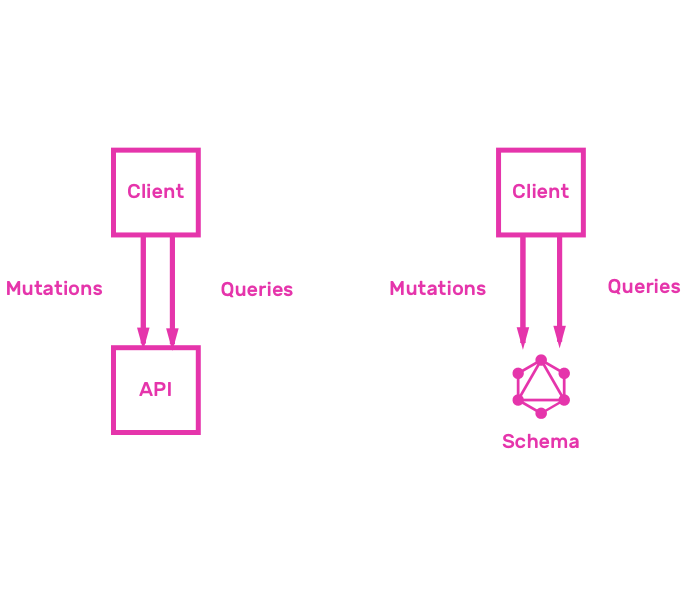
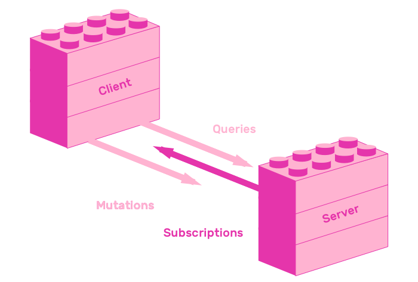

## 4. GraphQL APIs

* `ApolloServer`, `server.listen`
  * https://glitch.com/edit/#!/pinapp-server

### 4.1 Database

* Database
  * https://glitch.com/edit/#!/pinapp-database
* Authentication and Authorization

### 4.2 Business Logic

  * Add email based authentication
  * https://glitch.com/edit/#!/pinapp-email-authentication
  * Authorization in business logic
* Test GraphQL APIs using Jest

### 4.3 Testing

  * https://glitch.com/edit/#!/pinapp-server-testing
* Subscriptions

### 4.4 Subscriptions

  * Learn about GraphQL Subscriptions
  * Implement GraphQL Subscriptions server side
  * Send Subscription query from GraphiQL
  * https://glitch.com/edit/#!/pinapp-postgres
  * https://glitch.com/edit/#!/pinapp-subscriptions

### 4.5 File organization
  * https://glitch.com/edit/#!/pinapp-files

