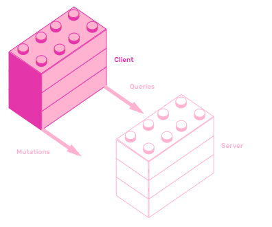
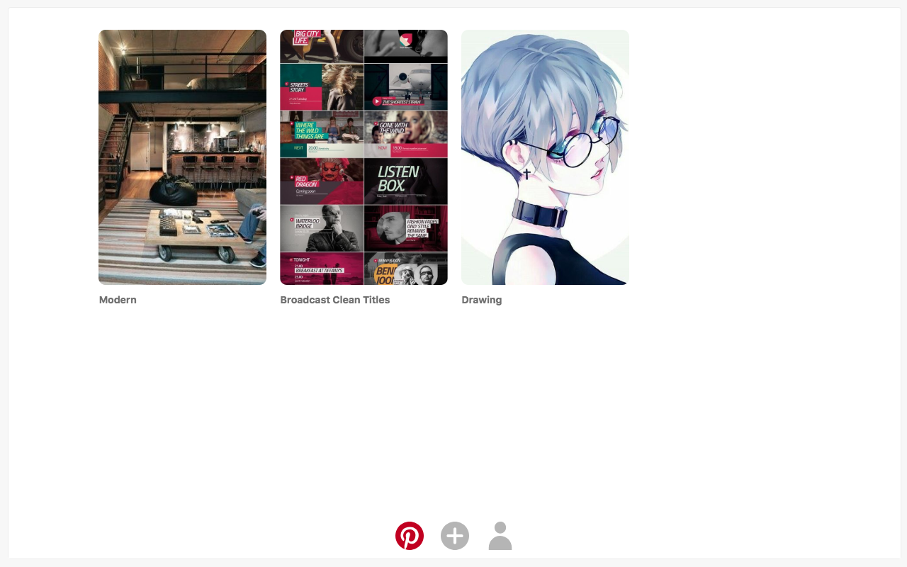
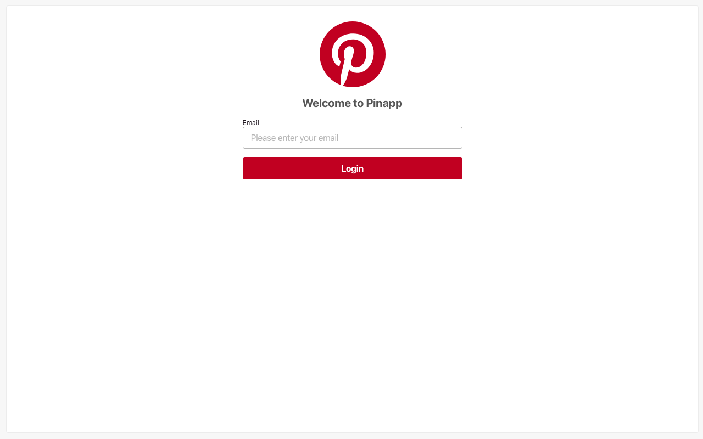
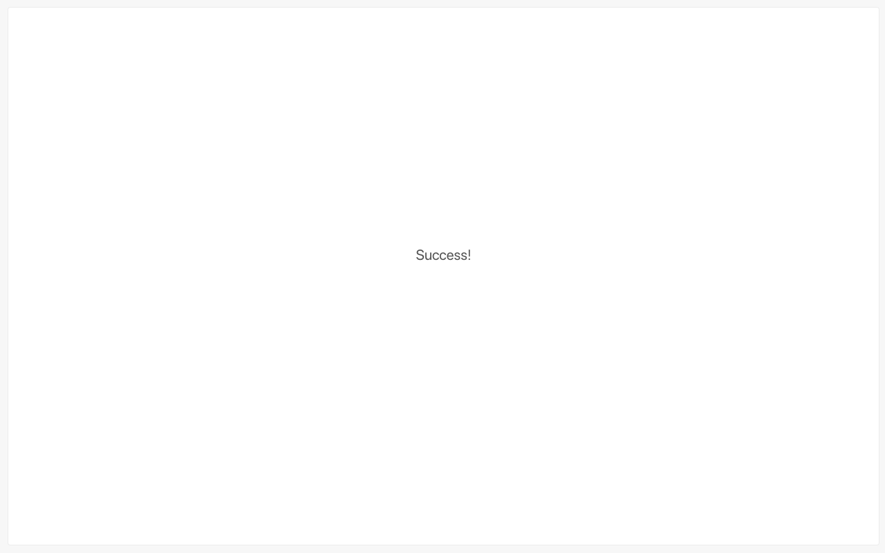
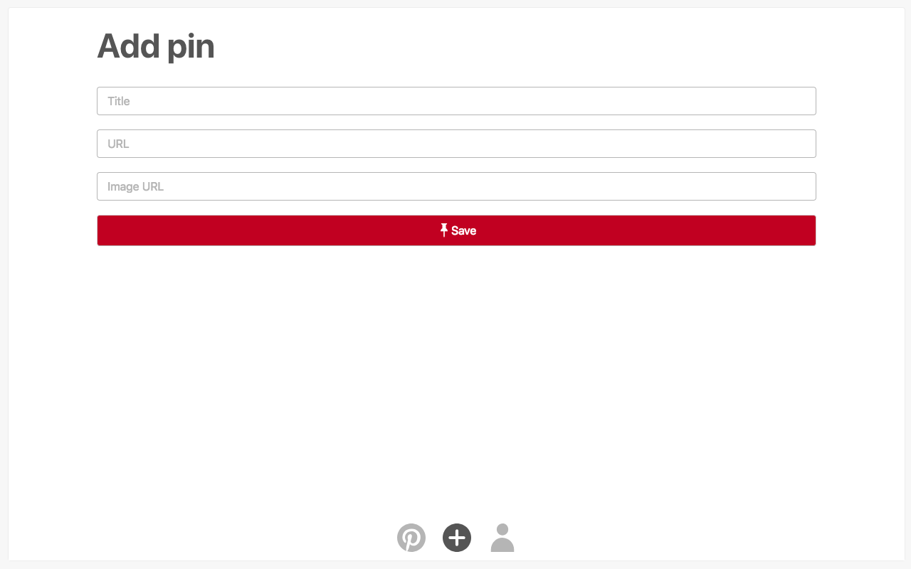
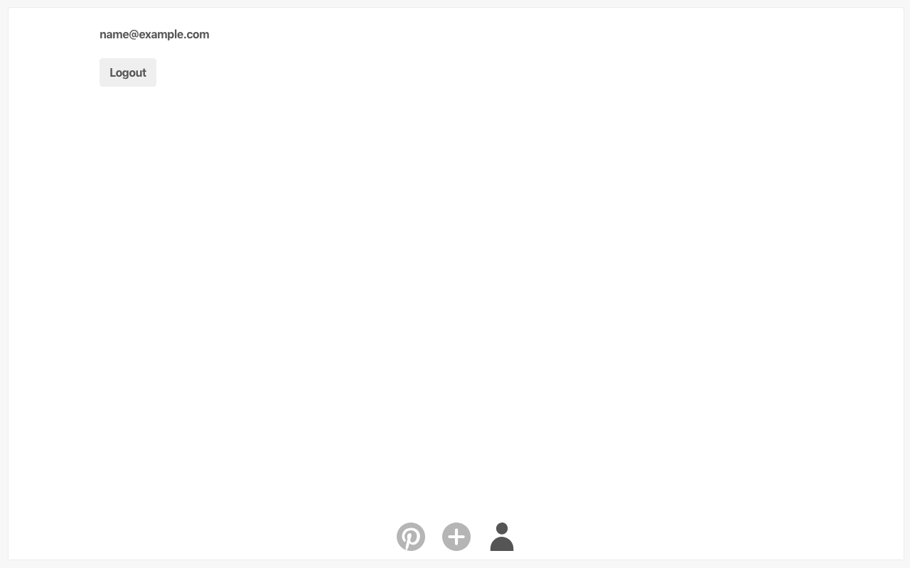

# 4. GraphQL clients

In this chapter you will learn how to build a GraphQL client using React and Apollo GraphQL.



You will start with a bare-bones React application, and transform it step-by-step into a GraphQL powered Pinterest clone. The first step will be making an app with all state stored in the client. After that you will learn how to add a GraphQL library called Apollo Client. Finally, you will learn how to easily fetch and store data in the GraphQL server using React Apollo's `Query` and `Mutation` components.

Let's start with the initial version of PinApp.

## 4.1 Initial React client

The first version of PinApp's client consists of a single `App` component that renders a `div` that says "PinApp". The project's setup is pretty standard, since it's based on the super popular [`create-react-app`](https://github.com/facebook/create-react-app). Here is the complete source code for `src/App.js`:

```js
import React from "react";

export default class App extends React.Component {
  render() {
    return <div>PinApp</div>;
  }
}
```

Remix this project to create your own copy of it:

[Remix initial React client](https://glitch.com/edit/#!/remix/pinapp-initial)

The next section will teach you how to create a client side version of PinApp.

## 4.2 Client side state

This section will teach you how to create a working, client-side only version of PinApp. To achieve this, you will use a library called [`pinapp-components`](https://github.com/GraphQLCollege/pinapp-components). This library exports a `Container` component, a `Nav` component and also five Page components, `PinListPage`, `LoginPage`, `VerifyPage`, `AddPinPage` and `ProfilePage`. To get to know all of these components, see them live in [the playground](https://graphqlcollege.github.io/pinapp-components).

These components expose a well defined API via their props. This customization enables you to use them to create a version of PinApp using only local state and passing it via props. Using the same components, but passing different props, you will create a version of PinApp backed by the GraphQL API you created in the previous chapter.

Following is a brief description of all components.

`Container` sets up PinApp's styling and routing configuration. Render it as the first in your component hierarchy. It only receives children as props.

`Nav` renders a list of actions as the app's footer. Actions are links to `/`, `/upload-pin` and `/profile`.

The rest of the components define a page each.

`PinListPage` renders a list of pins in the `/` URL. It receives just one argument, `pins`. `pins` is an array that contains a list of pins. Pins must be object with `title`, `image` and `link` properties. All three properties must be Strings.



`LoginPage` sets up the `/login` URL. It receives only one prop, `authenticate`. It is a function that will run when the user clicks "login". This function receives a string as an argument, which contains an email that the user entered.



`VerifyPage` sets up a screen in the `/verify?token={token}` URL. This component receives one prop called `verify`. It is a function that will run when the component mounts. This function passes a string argument which contains the token that the user entered in the URL's query string.



`AddPinPage` renders a form to create a pin in the `/upload-pin` URL. This component receives two props, `authenticated` and `addPin`. `authenticated` is a boolean. `addPin` is a function that will run when the user clicks "Save". It receives a pin object as argument.



The last page component is `ProfilePage`. It shows the users' profile in the `/profile` URL. It receives three props, `user`, `authenticated` and `logout`. `user` is an object with an `email` property. `authenticated` is a boolean. `logout` is a function that will run when the user clicks "Logout". It does not receive any arguments.



Now let's talk about how state management. The app will have three keys in state. It will hold an array of `pins`, a boolean called `authenticated` and a `user` object. The `App` component will have three functions that directly modify this state, called `addPin`, `verify` and `logout`. To simulate authentication, it will have an `authenticate` function that always authenticates the user. This `App` component will pass down its state and functions as props to the components from `pinapp-components`.

The first thing you need to do is add `"pinapp-components": "^1.0.1"` to the `"dependencies"` key in your `package.json`.

After adding `pinapp-components` as a dependency, modify `src/App.js` to look like this:

```js
import React from "react";
import {
  Container,
  Nav,
  PinListPage,
  AddPinPage,
  LoginPage,
  VerifyPage,
  ProfilePage
} from "pinapp-components";

export default class App extends React.Component {
  state = { pins: [], authenticated: false, user: null };
  addPin = pin => {
    this.setState(({ pins }) => ({
      pins: pins.concat([pin])
    }));
  };
  verify = () => {
    return success().then(token =>
      this.setState({
        authenticated: true,
        user: { email: "name@example.com" }
      })
    );
  };
  authenticate = () => {
    return Promise.resolve({});
  };
  logout = () => {
    this.setState({ authenticated: false, user: null });
  };
  render() {
    return (
      <Container>
        <PinListPage pins={this.state.pins} />
        <AddPinPage
          authenticated={this.state.authenticated}
          addPin={this.addPin}
        />
        <LoginPage authenticate={this.authenticate} />
        <VerifyPage verify={this.verify} />
        <ProfilePage
          authenticated={this.state.authenticated}
          user={this.state.user}
          logout={this.logout}
        />
        <Nav authenticated={this.state.authenticated} />
      </Container>
    );
  }
}

function success() {
  return wait(1000).then(() => "long-lived-token");
}

function wait(time) {
  return new Promise((resolve, reject) => {
    setTimeout(resolve, time);
  });
}
```

[Remix this step's application](https://glitch.com/edit/#!/remix/pinapp-client-side-state) if you got stuck in some way.

Congratulations! You have got a working version of PinApp. Too bad that all pins get lost when you refresh the application. This happens because the app stores everything in-memory. The next couple of sections will teach you how to connect PinApp with your GraphQL API.

## 4.3 Apollo Client

In this section you will add [Apollo Client](https://www.apollographql.com/client) to PinApp's frontend. You will setup Apollo Client, point it to the API you created in the previous chapter, and send a query to that endpoint.

Apollo Client is a GraphQL Client that provides advanced data loading to Javascript applications. It provides wrappers to many popular Javascript frameworks, like React, React Native, Angular, Vue.js, it also provides Native iOS and Android versions.

To install it, you need to add three dependencies to `package.json`. These dependencies are `apollo-boost",`, `graphql` and `graphql-tag`. This is what your `"dependencies"` key should look like:

```js
"dependencies": {
  "react-scripts": "^1.1.4",
  "react": "^16.3.2",
  "react-dom": "^16.3.2",
  "pinapp-components": "^1.0.1",
  "apollo-boost": "^0.1.6",
  "graphql": "^0.13.2",
  "graphql-tag": "^2.9.2"
},
```

Now it's time to setup Apollo Client in `src/App.js`. Import `apollo-boost` as `ApolloClient` and import `graphql-tag` as `gql`.

After that, create a new instance of `ApolloClient`, pass it an object with an `uri` key pointing to your GraphQL API URL, and assign it to a variable called `client`.

```js
import ApolloClient from "apollo-boost";
import gql from "graphql-tag";

const client = new ApolloClient({
  uri: process.env.REACT_APP_API_URL
});
```

Remember to add `REACT_APP_API_URL=https://pinapp-files.glitch.me` to the `.env` file, pointing to your API URL.

Once you have created an instance of Apollo Client, you can use it to send queries and mutations to your API. Let's use the `query` method from Apollo Client to fetch the list of pins from the API. This method receives an object with a `query` key. Inside that key you can send queries using the `gql` function from `graphql-tag`.

The `gql` function receives a string written in SDL and transforms it into a Javascript object. `client.query` accepts this Javascript object. Note that `client.query` throws an error if you pass a string directly, without using `gql`.

Another handy feature of `gql` is that many IDEs add syntax highlighting to `gql` calls. Unfortunately, at the moment Glitch does not support this feature. But who knows, maybe in the future it supports `gql` syntax highlighting. And maybe you are reading this in the future and enjoying beautiful GraphQL queries in our Glitch's code examples.

Add the following `componentDidMount` function to the `App` component:

```js
componentDidMount() {
  client
    .query({
      query: gql`
        {
          pins {
            title
            image
            link
          }
        }
      `
    })
    .then(result => this.setState({ pins: result.data.pins }));
}
```

You can click [here](https://glitch.com/edit/#!/remix/pinapp-apollo-client) to remix this step's version of PinApp. Remember to edit `REACT_APP_API_URL` in `.env`.

As you can see, it's really easy to use Apollo Client to communicate with GraphQL APIs. But Apollo Client provides an even better way of connecting your React application with a GraphQL API. It provides a library called React Apollo, which lets you collocate components with data by placing queries alongside your components. The next section will teach you how to setup React Apollo to interact with PinApp's API.

## 4.4 React Apollo

React Apollo is a library that lets you declaratively specify your component's data requirements. This means that your components can specify what data they need, instead of how to fetch that data. You achieve this by placing GraphQL queries in your components, and delegating how to fetch that data to Apollo Client.

## 4.5 Query component

A component that React Apollo provides is called `Query`. It receives one prop, called `query`, which accepts a GraphQL query. This component also receives a function as a child. Functions as child is a React pattern that lets you pass data from parents to children. Many of React Apollo's component use this pattern to pass down information. You can read more about passing functions to component in [React's official documentation](https://reactjs.org/docs/faq-functions.html).

The `Query` component passes down an object to its children. It contains three keys, `loading`, `error` and `data`. `loading` is a boolean that is true when the component started fetching data, but has not finished yet. `error` is an object that contains GraphQL errors, if any. `data` is an object that contains the GraphQL API's response.

Let's use this `Query` component. Create a file called `src/PinListPage.js`. If `loading` is true, it will return the `Spinner` from `pinapp-components`. If error is defined, it will display a `div` with the text "Error". And if `data` is defined, it will return `PinListPage` from `pinapp-components`.

```js
import React from "react";
import { Query } from "react-apollo";
import { PinListPage, Spinner } from "pinapp-components";

import { LIST_PINS } from "./queries";

class PinListPageContainer extends React.Component {
  render() {
    return (
      <Query query={LIST_PINS}>
        {({ loading, error, data }) => {
          if (loading) {
            return (
              <Spinner
                accessibilityLabel="Loading pins"
                show
              />
            );
          }
          if (error) {
            return <div>Error</div>;
          }
          return <PinListPage pins={data.pins} />;
        }}
      </Query>
    );
  }
}

export default PinListPageContainer;
```

You may have noticed that `PinListPage.js` references `LIST_PINS` from `queries`. Create this new file called `src/queries.js`. It will contain all queries that PinApp needs. Paste the following code in this new file.

```js
import gql from "graphql-tag";

export const ADD_PIN = gql`
  mutation AddPin($pin: PinInput!) {
    addPin(pin: $pin) {
      title
      link
      image
    }
  }
`;

export const LIST_PINS = gql`
  {
    pins {
      id
      title
      link
      image
      user_id
    }
  }
`;

export const CREATE_LONG_LIVED_TOKEN = gql`
  mutation CreateLongLivedToken($token: String!) {
    createLongLivedToken(token: $token)
  }
`;

export const CREATE_SHORT_LIVED_TOKEN = gql`
  mutation CreateShortLivedToken($email: String!) {
    sendShortLivedToken(email: $email)
  }
`;

export const ME = gql`
  {
    me {
      email
    }
  }
`;
```

## 4.6 Apollo Provider

In order to use React Apollo's `Query` component, you need to wrap your application with a component named `ApolloProvider`. It receives an instance of `ApolloClient`, and provides querying capabilities to `Query` components inside the component hierarchy.

```js
import { ApolloProvider } from "react-apollo";
```

Remove `PinListPage` from the list of imports from `pinapp-components` and import it from the file you just created.

```js
import PinListPage from "./PinListPage";
```

Put `ApolloProvider` as the first component in `App`'s `render`. Also remove `pins` prop from `PinListPage` because it does not need it anymore.

```js
<ApolloProvider client={client}>
  <Container>
    <PinListPage />
    {/* ... */}
  </Container>
</ApolloProvider>
```

Finally, you can now delete the `componentDidMount` function, because you load the list of pins using `Query`.

You can start seeing the benefits of declarative fetching using React Apollo, compared to fetching data in React's lifecycle methods, like `componentDidMount`.

## 4.7 Mutation component

React Apollo provides a component called `Mutation` that allows you to collocate mutations with React components.

It works similarly to `Query`, it receives a query as a prop and it also receives a function as its child.

It receives a GraphQL query, in this case that property is called `mutation` instead of `query`.

Similarly to `Query`, it receives a function as its child. The main difference is that this component passes down a function as its first argument, instead of an object with `data`, `loading` and `error`. It actually passes that object as a second argument, it will contain the data returned by the mutation. Calling this function will send a mutation to the GraphQL API configured in `ApolloProvider`.

Let's use React Apollo's `Mutation`. Create a file called `src/LoginPage.js`. Inside it, create a React class Component that returns `Mutation` in its `render` method. Place a function as a child of `Mutation`. This function will receive an argument called `createShortLivedToken`. `LoginPage` will receive a function in its `authenticate` property that calls `createShortLivedToken` when the user clicks "Login".

```js
import React from "react";
import { Mutation } from "react-apollo";
import { LoginPage } from "pinapp-components";

import { CREATE_SHORT_LIVED_TOKEN } from "./queries";

class LoginPageContainer extends React.Component {
  render() {
    return (
      <Mutation mutation={CREATE_SHORT_LIVED_TOKEN}>
        {createShortLivedToken => (
          <LoginPage
            authenticate={email =>
              createShortLivedToken({
                variables: { email }
              })
            }
          />
        )}
      </Mutation>
    );
  }
}

export default LoginPageContainer;
```

To use this component, remove `LoginPage` from the list of `pinapp-components` import in `src/App.js` and import it from the file you just created.

After sending a mutation to the server, you usually want to update the data in your app. For example, after adding a pin, you want to update the list of pins in your application. An easy way to achieve this is using another property from `Mutation`, called `refetchQueries`. It receives an array that contains the list of GraphQL queries to send after the mutation finishes.

To see `refetchQueries` in use, create a file called `src/AddPinPage.js` with the following contents:

```js
import React from "react";
import { Mutation } from "react-apollo";

import { AddPinPage } from "pinapp-components";
import { ADD_PIN, LIST_PINS } from "./queries";

class AddPinPageContainer extends React.Component {
  render() {
    return (
      <Mutation mutation={ADD_PIN}>
        {addPin => (
          <AddPinPage
            authenticated={this.props.authenticated}
            addPin={pin =>
              addPin({
                variables: { pin },
                refetchQueries: [{ query: LIST_PINS }]
              })
            }
          />
        )}
      </Mutation>
    );
  }
}

export default AddPinPageContainer;
```

Another useful prop that `Mutation` receives is called `update`. It is a function that gets called once your mutation finishes. You can use it to update React Apollo's internal state after a mutation finishes. In this case you are going to use it to get access to the token that the `createLongLived` query returns.

Create a file called `src/VerifyPage.js` and place the following code in it.

```js
import React from "react";
import { Mutation } from "react-apollo";
import { VerifyPage } from "pinapp-components";

import { CREATE_LONG_LIVED_TOKEN, ME } from "./queries";

class VerifyPageContainer extends React.Component {
  render() {
    return (
      <Mutation
        mutation={CREATE_LONG_LIVED_TOKEN}
        update={(cache, { data }) => {
          if (data && data.createLongLivedToken) {
            this.props.onToken(data.createLongLivedToken);
          }
        }}
      >
        {createLongLivedToken => (
          <VerifyPage
            verify={shortLivedToken =>
              createLongLivedToken({
                variables: {
                  token: shortLivedToken
                },
                refetchQueries: [{ query: ME }]
              })
            }
          />
        )}
      </Mutation>
    );
  }
}

export default VerifyPageContainer;
```

The `App` component will use `onToken` to update its state with the authentication token.

```js
<VerifyPage
  onToken={token => {
    localStorage.setItem("token", token);
    this.setState({ token });
  }}
/>
```

The final file you need to create is `src/ProfilePage.js`. This file does not contain any new API that you need to know. It uses `Query`, just like `PinListPage`. It uses the `ME` query from `queries.js`. This is what this file looks like:

```js
import React from "react";
import { Query } from "react-apollo";
import { ProfilePage } from "pinapp-components";

import { ME } from "./queries";

class ProfilePageContainer extends React.Component {
  render() {
    if (!this.props.authenticated) {
      return (
        <ProfilePage
          authenticated={this.props.authenticated}
          logout={this.props.logout}
          user={null}
        />
      );
    }
    return (
      <Query query={ME}>
        {({ loading, error, data }) => {
          return (
            <ProfilePage
              authenticated={this.props.authenticated}
              logout={this.props.logout}
              user={{
                email:
                  data && data.me ? data.me.email : null
              }}
            />
          );
        }}
      </Query>
    );
  }
}

export default ProfilePageContainer;
```

The last step you need to take before reaching the final version of PinApp is replacing `src/App.js` with the following code:

```js
import React from "react";
import ApolloClient from "apollo-boost";
import { ApolloProvider } from "react-apollo";
import { Container, Nav } from "pinapp-components";

import PinListPage from "./PinListPage";
import LoginPage from "./LoginPage";
import VerifyPage from "./VerifyPage";
import AddPinPage from "./AddPinPage";
import ProfilePage from "./ProfilePage";

const client = new ApolloClient({
  uri: process.env.REACT_APP_API_URL,
  request: operation => {
    if (this.state.token) {
      operation.setContext({
        headers: { Authorization: this.state.token }
      });
    }
  }
});

export default class App extends React.Component {
  state = {
    token: null
  };
  componentDidMount() {
    const token = localStorage.getItem("token");
    if (token) {
      this.setState({ token });
    }
  }
  logout = () => {
    localStorage.removeItem("token");
    this.setState({ token: null });
  };
  render() {
    return (
      <ApolloProvider client={client}>
        <Container>
          <PinListPage />
          <AddPinPage authenticated={!!this.state.token} />
          <LoginPage />
          <VerifyPage
            onToken={token => {
              localStorage.setItem("token", token);
              this.setState({ token });
            }}
          />
          <ProfilePage
            authenticated={!!this.state.token}
            logout={this.logout}
          />
          <Nav authenticated={!!this.state.token} />
        </Container>
      </ApolloProvider>
    );
  }
}
```

[Remix](https://glitch.com/edit/#!/remix/pinapp-react-apollo) the final version of PinApp's client to see what it looks like.

## 4.5 Summary

You created a version of PinApp using only local state, learned how to use Apollo Client and React Apollo to connect this app with a GraphQL API. You achieved this using React Apollo's `Query` and `Mutation` to easily send queries and mutations.

The next chapter will teach you how to add real time functionality to apps using GraphQL Subscriptions, which let GraphQL APIs push data to clients.

