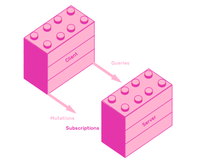

# 5. Subscriptions

GraphQL servers can provide a way for clients to fetch data in response to server-sent events. This enables GraphQL powered applications to push data to users in response to events.

For example, you could use Subscriptions to send notifications to users when another user creates new pins.



This chapter will teach you how to implement subscriptions, both on your GraphQL API and frontend.

## 5.1 Server side subscriptions

Subscriptions are implemented as a persisting connection between server and client, as opposed to queries and mutations, which are implemented as request/response actions. This means that Subscriptions use Websockets as their transport layer, instead of HTTP.

To implement server-side subscriptions you need to declare a top-level Subscription type, implement a resolver for each of its fields, and finally wire up a PubSub system to handle events.

## 5.2 PubSub systems

GraphQL subscriptions implementations require you to setup a PubSub adapter, but you are not tied to any particular system. You can use an in memory PubSub, Redis, RabbitMQ, Postgres and more. This is a list of the different [PubSub implementations](https://github.com/apollographql/graphql-subscriptions#pubsub-implementations).

Using Postgres as a PubSub system is a great way of keeping your API simple. Postgres can serve both as a database, and as an event system.

Since we are already using Knex to handle database interactions, migrating from SQLite3 to Postgres will be straightforward. Let's prepare your API for subscriptions by migrating its database to Postgres.

The migration consists on creating a Postgres database, and pointing knex configuration to its URL, instead of pointing it to a SQLite file.

Install the `pg` library by adding it to `package.json`'s `dependencies`.

```js
"dependencies": {
  // ...
  "pg": "^7.4.3"
}
```

Replace all the code in `knexfile.js` with this:

```js
const pg = require("pg");

// Hack required to support connection strings and ssl in knex
// https://github.com/tgriesser/knex/issues/852#issuecomment-229502678
pg.defaults.ssl = true;

let connection = process.env.DATABASE_URL;

module.exports = {
  client: "pg",
  connection
};
```

Now, create a Postgres database. We recommend creating a [Heroku Postgres](https://www.heroku.com/postgres) databases, because they are easy to create. But you can create a Postgres instance in the way that you feel most comfortable.

To create a Postgres database using Heroku, you need to create an account. After that, go to `https://dashboard.heroku.com/apps` and create a new app. Once you create the app, provision an add-on called `Heroku Postgres` by navigating to your app's resources page. You need to copy this database's URL by going to "Settings" -> "Config Vars" and copying the value of `DATABASE_URL`.

Once you have the database url, place it inside your project's `.env` as `DATABASE_URL=url_that_you_just_copied`. Run `npm run setup-db` inside your project's console to verify your database connection and set up all migrations.

[Remix this step's project](https://glitch.com/edit/#!/remix/pinapp-postgres) if you got stuck somewhere along the way.

Database migration finished! You are now ready to implement server side subscriptions using Postgres as a PubSub system.

## 5.3 Implementing server side Subscriptions

You will implement a way for clients to receive events every time a new pin is added. This event allows clients features like updating the pins list in real time, or showing a notification every time another user creates a pin.

Add a new `Subscription` type to `pins/schema.graphql`. It will have a single field called `pinAdded`, which will return a `Pin`.

```graphql
# ...
type Subscription {
  pinAdded: Pin
}
```

After that, add a new key called `Subscription` to the resolvers list in `pins/resolvers.js`. Add a type resolver for `pinAdded`, which will be an object with a `subscribe` key. Subscriptions resolvers are not functions, like Query or Mutation resolvers, they are objects with a `subscribe` key that returns `AsyncIterable`.

What is an `AsyncIterable`? Asynchronous iteration is a data access protocol, a way to iterate through asynchronous data sources. [It is an ECMAScript proposal](https://github.com/tc39/proposal-async-iteration), which means it has a high chance of becoming a part of the language. [GraphQL.js subscriptions use them because they will be a part of the Javascript standard eventually](https://github.com/graphql/graphql-js/issues/1135#issuecomment-350928960).

Anyway, you need to return an `AsyncIterable` object in subscriptions' `subscribe` functions. All subscription compatible PubSub implementations provide a method called `asyncIterator` which receives an event name and return an `AsyncIterable`.

```js
Subscription: {
  pinAdded: {
    subscribe: () => {
      return pubsub.asyncIterator("pinAdded");
    };
  }
}
```

Install the Postgres subscriptions PubSub by adding the following line to `package.json`'s dependencies list:

```json
"dependencies": {
  "graphql-postgres-subscriptions": "^1.0.1"
}
```

After adding this new dependency, create a new instance of it and assign it to a new variable called `pubsub`.

```js
const pubsub = new PostgresPubSub({
  connectionString: `${process.env.DATABASE_URL}?ssl=true`
});
```

When a new pin is created, you can fire an event to notify all users of this new pin.

```js
pubsub.publish("pinAdded", { pinAdded: createdPin });
```

This is what the new Subscription resolver from `pins/resolvers.js` looks like:

```js
const {
  PostgresPubSub
} = require("graphql-postgres-subscriptions");

const { addPin } = require("./index");
const { verify, authorize } = require("../authentication");
const database = require("../database");

const pubsub = new PostgresPubSub({
  connectionString: `${process.env.DATABASE_URL}?ssl=true`
});

const resolvers = {
  Query: {
    pins: () => database("pins").select()
  },
  Mutation: {
    addPin: async (_, { pin }, { token }) => {
      const [user] = await authorize(database, token);
      const {
        user: updatedUser,
        pin: createdPin
      } = await addPin(user, pin);
      await database("pins").insert(createdPin);
      pubsub.publish("pinAdded", { pinAdded: createdPin });
      return createdPin;
    }
  },
  Subscription: {
    pinAdded: {
      subscribe: () => {
        return pubsub.asyncIterator("pinAdded");
      }
    }
  }
};

module.exports = resolvers;
```

The final changes you need to make are in `src/server.js`. You need to add `subscriptions: true` to the Apollo Server constructor. You also need to check for the existence of `req` and `req.headers`, because subscriptions don't send a `req` object.

```js
const { ApolloServer } = require('apollo-server');

const schema = require('./schema');

const server = new ApolloServer({
  schema,
  context: async ({ req }) => {
    const context = {};
    if (req && req.headers && req.headers.authorization) {
      context.token = req.headers.authorization;
    }
    return context;
  },
  subscriptions: true
});

server.listen().then(({ url }) => {
  console.log(`🚀  Server ready at ${url}`);
});
```

[Remix](https://glitch.com/edit/#!/remix/pinapp-subscriptions) if you need a working version of the subscriptions example.

Congratulations! You just implemented server side subscriptions. Now head over to your project's GraphQL Playground by clicking "Show".

Complete the authentication process by sending a `sendShortLivedToken` mutation. Copy the token you received in your email inbox, and send it as a `token` param in `createLongLivedToken`. Place the result of the last mutation as an "Authorization" header.

```json
{
  "Authorization": "eyJhbGciOiJIUzI..."
}
```

Keep this tab open, and create a new tab pointing to your GraphQL Playground. Create a new subscription query and press the play button. You will see a loading screen that says "Listening...".

```graphql
subscription {
  pinAdded {
    title
    id
  }
}
```

Go back to your first mutation, paste the following `AddPin` mutation.

```graphql
mutation AddPin($pin: PinInput!) {
  addPin(pin: $pin) {
    title
  }
}
```

And fill the pin variable argument in the "Query Variables" section.

```json
{
  "pin": {
    "title": "Hello subscriptions!",
    "link": "https://pinapp-subscriptions.glitch.me/",
    "image": "https://pinapp-subscriptions.glitch.me/"
  }
}
```

You should see the created pin data instead of "Loading...".

```json
{
  "data": {
    "pinAdded": {
      "title": "Hello subscriptions!",
      "id": "cce1efda-b851-4272-b840-9aefbb84097f"
    }
  }
}
```

The next section will show you how to send subscriptions with React Apollo.

## 5.4 Client side subscriptions

Apollo client supports GraphQL subscriptions. Because subscriptions is an advanced feature of GraphQL, creating a client that supports subscriptions takes a little more effort than implementing a simple client. Instead of creating an instance of `"apollo-boost"`, you will create an instance of the more configurable `ApolloClient` from `"apollo-client"`.

Setting up ApolloClient from `"apollo-client"` requires a bit more knowledge about the implementation details of Apollo Client than using `apollo-boost`, more specifically knowledge about its cache and link properties.

Apollo client manages the data returned from GraphQL queries in a cache. As you may know, this library does much more than just providing a nice interface for interacting with GraphQL servers. It provides advanced data management features like caching, pagination, prefetching and more. It stores all information in a cache. This cache is configurable, you can store items in memory, in a redux store, and more.

The network layer of Apollo client is called Apollo link. Links direct where your data goes and where it comes from. You can use Apollo link to swap your HTTP layer with a Websockets layer, or even use mocks instead of network calls.

You will learn how to migrate away from Apollo boost to the configurable Apollo client in the next section.

## 5.5 Apollo boost migration

This is what client initialization looks like with Apollo Boost.

```js
const client = new ApolloClient({
  uri: process.env.REACT_APP_API_URL,
  request: operation => {
    if (this.state.token) {
      operation.setContext({
        headers: { Authorization: this.state.token }
      });
    }
  }
});
```

Apollo client needs you to explicitly set its data store by setting a cache, and configure the network layer with links. You will use `apollo-link-http` to point HTTP requests to your API. To simulate Apollo Boost error handling, you will setup `apollo-link-error`. Finally, you need the app to keep providing dynamic request interceptors in order to add the authentication token to every request. You will achieve this creating a custom instance of `ApolloLink`.

Install the new dependencies to `package.json`. Remove `apollo-boost` and add the following dependencies:

```json
"dependencies": {
  // ...
  "apollo-client": "^2.3.1",
  "apollo-cache-inmemory": "^1.2.1",
  "apollo-link-http": "^1.5.4",
  "apollo-link-error": "^1.0.9",
  "apollo-link": "^1.2.2"
}
```

Apollo client receives a link and cache properties. Setting up the cache will be much more straightforward than setting up the link. The Apollo client constructor receives an object with `link` and `cache` properties. Import `InMemoryCache` from `apollo-cache-inmemory`, initialize `InMemoryCache` and pass it to Apollo client.

```js
// ...
import { ApolloClient } from "apollo-client";
import { InMemoryCache } from "apollo-cache-inmemory";

// ...

const client = new ApolloClient({
  cache: new InMemoryCache()
});
```

Now add a link property to `new ApolloClient()`. To create a single link from the previous links, you will use `ApolloLink.from`. This function receives an array of links, merges them and returns a single link.

You will pass three links to `ApolloLink.from`. The first will contain a function that runs every time there is a network error. Create it using `onError` from `apollo-link-error`. The role of this function will be to check if the error is a network or GraphQL error, and log it accordingly.

```js
onError(({ graphQLErrors, networkError }) => {
  if (graphQLErrors)
    graphQLErrors.map(({ message, locations, path }) =>
      console.log(
        `[GraphQL error]: Message: ${message}, Location: ${locations}, Path: ${path}`
      )
    );
  if (networkError)
    console.log(`[Network error]: ${networkError}`);
});
```

The second link will simulate Apollo Boost's request interception. The app uses this feature to insert the token in every request, so it's important to keep providing this. The implementation of this function uses Observables. You could think as Observables as a superset of Promises. Learning about Observables is outside the scope of this book, but don't worry, we will only use them in this snippet.

React Apollo has great information about how to migrate from Apollo Boost. They introduce this implementation of request interceptor in [their migration docs](https://www.apollographql.com/docs/react/advanced/boost-migration.html#advanced-migration).

This is how you create an `ApolloLink` that intercepts every request:

```js
new ApolloLink((operation, forward) => {
  const request = async operation => {
    if (this.state.token) {
      operation.setContext({
        headers: { Authorization: this.state.token }
      });
    }
  };
  return new Observable(observer => {
    let handle;
    Promise.resolve(operation)
      .then(oper => request(oper))
      .then(() => {
        handle = forward(operation).subscribe({
          next: observer.next.bind(observer),
          error: observer.error.bind(observer),
          complete: observer.complete.bind(observer)
        });
      })
      .catch(observer.error.bind(observer));

    return () => {
      if (handle) handle.unsubscribe();
    };
  });
});
```

Luckily, to add the third link, `HttpLink`, you just need to create a new instance of it and point it to your API's URL.

```js
new HttpLink({
  uri: process.env.REACT_APP_API_URL,
  credentials: "same-origin"
});
```

This is how the initialization of `ApolloClient` looks like after adding all links and cache:

```js
import React from "react";
import { Container, Nav } from "pinapp-components";
import { ApolloProvider } from "react-apollo";
import { ApolloClient } from "apollo-client";
import { InMemoryCache } from "apollo-cache-inmemory";
import { HttpLink } from "apollo-link-http";
import { onError } from "apollo-link-error";
import { ApolloLink, Observable } from "apollo-link";

// ...

const client = new ApolloClient({
  link: ApolloLink.from([
    // Simulate Apollo Boost error handling
    onError(({ graphQLErrors, networkError }) => {
      if (graphQLErrors)
        graphQLErrors.map(({ message, locations, path }) =>
          console.log(
            `[GraphQL error]: Message: ${message}, Location: ${locations}, Path: ${path}`
          )
        );
      if (networkError)
        console.log(`[Network error]: ${networkError}`);
    }),
    // Enable dynamic request interceptors
    new ApolloLink((operation, forward) => {
      const request = async operation => {
        if (this.state.token) {
          operation.setContext({
            headers: { Authorization: this.state.token }
          });
        }
      };
      return new Observable(observer => {
        let handle;
        Promise.resolve(operation)
          .then(oper => request(oper))
          .then(() => {
            handle = forward(operation).subscribe({
              next: observer.next.bind(observer),
              error: observer.error.bind(observer),
              complete: observer.complete.bind(observer)
            });
          })
          .catch(observer.error.bind(observer));

        return () => {
          if (handle) handle.unsubscribe();
        };
      });
    }),
    new HttpLink({
      uri: process.env.REACT_APP_API_URL,
      credentials: "same-origin"
    })
  ]),
  cache: new InMemoryCache()
});
```

As in every important PinApp milestone, feel free to [remix this step](https://glitch.com/edit/#!/remix/pinapp-apollo-boost-migration).

And that's how you migrate from Apollo Boost. The ability to compose links provides the starting point for adding subscriptions to Apollo Client. The next section will teach you how to add a websockets transport using `apollo-link-ws`.

## 5.6 Implementing client side subscriptions

In this section you will add to `PinListPage` the ability to subscribe for more pins. You will achieve this using GraphQL subscriptions. The app previously used `refetchQueries` to fetch all pins once the user added a new one. This new method will be much more efficient, because you won't send a new query, but instead listen to new pins and add them individually.

The first step is adding to Apollo Client the ability to determine whether an operation needs to be handled using HTTP or Websockets. To achieve this, you will use a function from `apollo-client` called [`split`](https://www.apollographql.com/docs/link/composition.html#directional). It receives three functions as argument. The first function determines whether an operation should use the link from the second argument if it returns `true`, or the second link otherwise.

Replace the third element of the `ApolloLink.from` array in `src/App.js` with a `split` call that redirects subscriptions to `WebSocketLink`:

```js
import { ApolloLink, Observable, split } from "apollo-link";
import { WebSocketLink } from "apollo-link-ws";
import { getMainDefinition } from "apollo-utilities";

// ...

const client = new ApolloClient({
  link: ApolloLink.from([
    // ...,
    // ...,
    split(
      // split based on operation type
      ({ query }) => {
        const { kind, operation } = getMainDefinition(
          query
        );
        return (
          kind === "OperationDefinition" &&
          operation === "subscription"
        );
      },
      new WebSocketLink({
        uri: process.env.REACT_APP_API_URL.replace(
          "https://",
          "wss://"
        ),
        options: {
          reconnect: true
        }
      }),
      new HttpLink({
        uri: process.env.REACT_APP_API_URL,
        credentials: "same-origin"
      })
    )
  ]),
  cache: new InMemoryCache()
});
```

Now that your client knows how to handle subscriptions, add a `pinAdded` subscription to `src/queries.js`:

```js
export const PINS_SUBSCRIPTION = gql`
  subscription {
    pinAdded {
      title
      link
      image
      id
      user_id
    }
  }
`;
```

Remove the `refetchQueries` prop in `src/AddPinPage.js`. The app is going to subscribe to new pins, instead of fetching all pins when a new one is added.

The last step is adding a `subscribeToMore` function to the pin list component. It will call that function when it mounts.

```js
class PinListPageContainer extends React.Component {
  componentDidMount() {
    this.props.subscribeToMore();
  }
  render() {
    return <PinListPage pins={this.props.pins} />;
  }
}
```

You will create a new component that will send it the `subscribeToMore` function as a prop. It will pass that information, along with the list of pins, using the functions as children pattern.

```js
export default () => (
  <PinListQuery>
    {({ pins, subscribeToMore }) => (
      <PinListPageContainer
        pins={pins}
        subscribeToMore={subscribeToMore}
      />
    )}
  </PinListQuery>
);
```

The implementation of `PinListQuery` will be very similar to the implementation of `PinListPage` from the previous version of PinApp. The main difference will be that it receives a function as children, and passes it a `subscribeToMorePins` function. It will create that function in its render method, based on a property of the object that `Query` returns, called `subscribeToMore`.

[`subscribeToMore`](https://www.apollographql.com/docs/react/advanced/subscriptions.html#subscribe-to-more) uses the data it received on a query and merges it directly into the store. It receives an object with two properties, a query in its `document` key, and a function called `updateQuery`.

The function that determines how to merge the new data with the existing data is called `updateQuery`. It receives two arguments, the previous data stored as its first argument and the query response on the second argument.

You are going to create a function that checks whether the new data contains a `pinAdded` property. If it does, you will merge the `pins` property of the previous data with the new added pin.

```js
class PinListQuery extends React.Component {
  render() {
    return (
      <Query query={LIST_PINS}>
        {({ loading, error, data, subscribeToMore }) => {
          if (loading) {
            return (
              <Spinner
                accessibilityLabel="Loading pins"
                show
              />
            );
          }
          if (error) {
            return <div>Error</div>;
          }
          const subscribeToMorePins = () => {
            return subscribeToMore({
              document: PINS_SUBSCRIPTION,
              updateQuery: (prev, { subscriptionData }) => {
                if (
                  !subscriptionData.data ||
                  !subscriptionData.data.pinAdded
                ) {
                  return prev;
                }
                const newPinAdded =
                  subscriptionData.data.pinAdded;

                return Object.assign({}, prev, {
                  pins: [...prev.pins, newPinAdded]
                });
              }
            });
          };
          return this.props.children({
            pins: data.pins,
            subscribeToMore: subscribeToMorePins
          });
        }}
      </Query>
    );
  }
}
```

That's it! Now not only you will be able to see the pins you add in the list of pins, but anyone using the app will see the created pin, thanks to subscriptions.

[Remix this step's project](https://glitch.com/edit/#!/remix/pinapp-client-subscriptions) if you got stuck in any step, and refer to the official [React Apollo's subscriptions documentation](https://www.apollographql.com/docs/react/advanced/subscriptions.html) to learn more about subscriptions.

## 5.7 Summary

You learned what subscriptions are, how to add them both to the backend and frontend. Before adding subscriptions to your backend, you migrated your database from SQLite3 to Postgres, because it also serves as a PubSub system. You also migrated your frontend from Apollo Boost to Apollo Client before adding subscriptions.

At this point, PinApp has several complex features, so adding a comprehensive test suite makes sense. The next chapter will teach you how to test your backend and frontend using different testing strategies.

