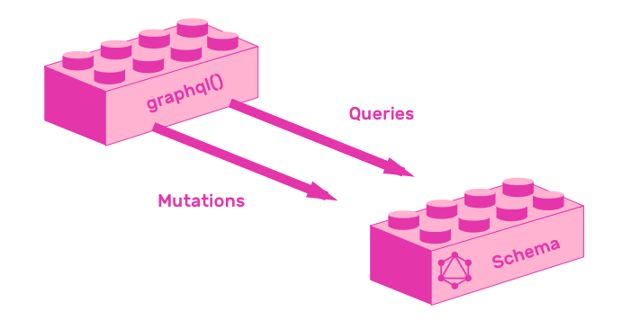
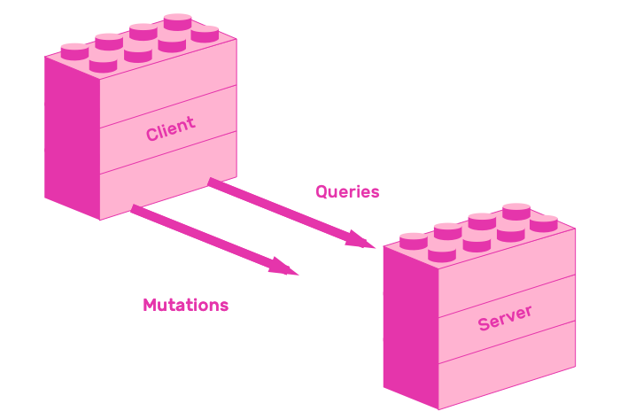

# 6. Testing

Testing is key when producing solid software. A solid testing suite improves development speed because it provides confidence that all features keep working after adding new functionality.

This chapter will teach you how to test GraphQL APIs and clients. You will write tests that verify the behavior of all features you added in this book.

Let's start by learning about API testing.

## 6.1 How to test GraphQL APIs

This section will teach you how to test GraphQL APIs using two approaches. The first will test the GraphQL layer, and the second will test the HTTP layer. Both methods will use [Jest](http://facebook.github.io/jest/), a Javascript testing library.

The first approach tests the GraphQL layer by sending queries and mutations directly against the app's schema.



The second approach tests that the HTTP layer works by creating a test client that sends queries and mutations against a server.



Both methodologies have benefits. Testing the HTTP layer is a great way to verify that your API works from the point of view of HTTP clients, which are the end users of an API. The other approach, testing the GraphQL layer, is faster and simpler because it does not add any HTTP-related overhead.

Which one you choose depends on your use case. It is always a good idea to test systems from the point of view of their users, so testing APIs in the HTTP layer is always a great approach. Sometimes you want faster test runs to improve developer productivity, so you decide that testing the GraphQL layer is the best approach. Remember that you can even mix and match approaches.

## 6.2 Testing setup

Before creating the tests itself, you will need to make some changes so that the codebase is more testable. Right now `server.js` defines a `Server` class, initializes it and calls `server.listen()`. The first change you need to make is split definition from usage.

Create a file called `index.js`. It will `require` the Server class from `server.js`, and call `listen`.

```js
const Server = require("./server");

const server = new Server();

server.listen().then(({ url }) => {
  console.log(`🚀  Server ready at ${url}`);
});
```

Modify the `start` script from `package.json`. It will run `index.js` instead of `server.js`.

```json
"scripts": {
  "start": "node index.js",
  // ...
},
```

Now it's time to prepare `server.js` for testing. You will modify `Server` so that you are able to setup and stop it between tests. The Server class needs to initialize in its constructor all the resources it needs, and free up those resources in its `stop` method.

Initialize database and pubsub in server's constructor. At this point, database initialization happens in `database.js`, and pubsub initialization happens in `pins/resolver.js`. Now they will both happen in the `Server` constructor from `server.js`.

Also create a `stop` function in the `Server` class. It will clean up the main database client and the pubsub database client. This is very important, because if you don't clear up database connections after each test run, you will have to manually stop your test suite because you will quickly run out of available database connections.

```js
const { ApolloServer } = require('apollo-server');
const { PostgresPubSub } = require("graphql-postgres-subscriptions");
const { Client } = require("pg");

const schema = require('./schema');
const createDatabase = require('./database');

class Server extends ApolloServer {
  constructor() {
    const database = createDatabase();
    const client = new Client({
      connectionString: process.env.NODE_ENV === "test" ?
        `${process.env.TEST_DATABASE_URL}?ssl=true` :
        `${process.env.DATABASE_URL}?ssl=true`
    });
    client.connect();
    const pubsub = new PostgresPubSub({
      client
    });
    super({
      schema,
      context: async ({ req }) => {
        const context = { database, pubsub };
        if (req && req.headers && req.headers.authorization) {
          context.token = req.headers.authorization;
        }
        return context;
      }
    });
    this.database = database;
    this.pubsub = pubsub;
  }
  stop() {
    return Promise.all([
      super.stop(),
      this.database.destroy(),
      this.pubsub.client.end()
    ]);
  }
}

module.exports = Server;
```

You may have noticed a new database url, called `TEST_DATABASE_URL`. Create a new database in any provider you'd like, and assign it to `TEST_DATABASE_URL=` in `.env`. Creating Postgres databases in Heroku is free of charge.

Now all resolvers can access database from their third argument, `context`. Modify all three resolvers by removing `const database = require("../database")` and accessing it from context.

Modify `authentication/resolvers.js`:

```js
// ...
const resolvers = {
  Query: {
    users: async (_, __, { database }) => { /* */ },
    me: async (_, __, { token, database }) => { /* */ }
  },
  Mutation: {
    sendShortLivedToken: async (_, { email }, { database }) => { /* */ },
    createLongLivedToken: (_, { token }) => { /* */ }
  },
  Person: { /* */ },
  User: {
    pins(person, _, { database }) { /* */ }
  }
```

Modify `pins/resolvers.js`. Remove `PostgresPubSub` initialization, because it already is in `server.js`. Access `pubsub` and `database` from resolvers' context.

```js
const { addPin } = require("./index");
const { verify, authorize } = require("../authentication");

const resolvers = {
  Query: {
    pins: (_ , __ , { database }) => database("pins").select(),
  },
  Mutation: {
    addPin: async (_, { pin }, { token, database, pubsub }) => { /* */ }
  },
  Subscription: {
    pinAdded: {
      subscribe: (_, __, { pubsub }) => { /* */ }
    }
  }
};

module.exports = resolvers;
```

Modify `search/resolvers.js`:

```js
const resolvers = {
  Query: {
    search: async (_, { text }, { database }) => { /* */ }
  },
  SearchResult: {
    __resolveType: searchResult => { /* */ }
  }
};

module.exports = resolvers;
```

Also modify `database.js` so that it exports an initialization function, instead of initializing the database and exporting its instance.

```js
module.exports = () => require('knex')(require("./knexfile"));
```

The final thing you need before you start writing tests is adding Jest to the `"devDependencies"` in `package.json` and also adding a `"test"` script. This script will run `jest --watchAll --runInBand`. `watchAll` reruns the test suite whenever a file changes, and `runInBand` runs all tests serially instead of concurrently. This behavior is necessary because all tests share a single database, and running all of them at the same time would result in data corruption.

```json
{
  "scripts": {
    // ...
    "test": "jest --watchAll --runInBand"
  },
  "devDependencies": {
    "jest": "^22.4.3"
  },
```

As with all examples, you can [remix the testing example](https://glitch.com/edit/#!/remix/pinapp-server-testing) in case you need to refer to a working project.

## 6.3 GraphQL layer

Testing the data layer is as simple as using the `graphql` function from `graphql-js` against your schema. You will recognize this pattern, because it is the same approach you used to learn queries and mutations in Chapter 1. The only difference this time is that you will use this library in the context of a Jest test.

To test queries using this approach, a good strategy is seeding the database before the first test, and cleaning it up after the last one. This allows you to write fast tests that verify multiple queries, because queries don't modify your data.

Jest snapshots are a great tool to test results of GraphQL queries. Snapshots store values in JSON files from each test on the first run. On successive runs of the test suite, Jest checks that the stored values have not changed. If the snapshots changed, the test fails; otherwise, it passes.

Testing GraphQL results using snapshots is great because it is low effort way to verify that everything works. You can write tests by focusing on requests, and not on responses. Focusing on JSON responses can be a lot of manual work, so delegating it to Jest makes you write tests in less time.

For example to write a test that checks the behavior of the `search` query, you could create a test that calls `graphql()` with a search query, a `"text"` variable with value `"First"`, and the app's schema.

You are going to use this technique to test the data layer of PinApp's. Create a file called `server.test.js` with the following code that tests users, pins and search queries:

```js
const { graphql } = require("graphql");

const createDatabase = require("./database");
const schema = require('./schema');
const { search } = require("./queries");

describe("GraphQL layer", () => {
  let database;
  beforeAll(async () => {
    database = createDatabase();
    return database.seed.run();
  });
  afterAll(() => database.destroy());

  it("should return users' pins", () => {
    const query = `
  {
    users {
      id
      email
      pins {
        user_id
      }
    }
  }  
  `;
    return graphql(schema, query, undefined, { database })
      .then(result => {
        expect(result.data.users).toMatchSnapshot();
      });
  });

  it("should list all pins", () => {
    const query = `
  {
    pins {
      id
      title
      link
      image
      user_id
    }
  }
  `;
    return graphql(schema, query, undefined, { database })
      .then(result => {
        expect(result.data.pins).toMatchSnapshot();
      });
  });

  it("should search pins by title", () => {
    return graphql(schema, search, undefined, { database }, { text: "First" })
      .then(result => {
        expect(result.data.search).toMatchSnapshot();
      });
  });
});
```

This approach is inspired by an awesome open source project called [Spectrum](https://spectrum.chat/). It has an extensive testing suite that uses Jest snapshots to test their GraphQL schema. Check out [Spectrum's github repository](https://github.com/withspectrum/spectrum/tree/e603e77bbb965bbbc7c678d9e9295e976c9381e0/api/test) to see this approach in a production codebase.

Sometimes it's best to recreate the exact conditions in which users interact with a system. In this case, users are HTTP clients, not `graphql-js` clients. The next section will teach you how to test the HTTP layer of GraphQL APIs.

## 6.4 HTTP Layer

To test the HTTP layer, you are going to create an instance of `Server` before each test, and stop it after each one. You are also going to delete all pins and users before each test, and delete all emails.

```js
const { graphql } = require("graphql");

const createDatabase = require("./database");
const schema = require('./schema');
const { search } = require("./queries");
const Server = require("./server");
const { deleteEmails } = require("./email");

describe("GraphQL layer", () => { /* */ });

describe("HTTP layer", () => {
  let server;
  let serverInfo;

  beforeEach(async () => {
    server = new Server();
    /*
      Ignore event emitter errors.
      In most cases this error appears because a database query got sent after closing database connection.
    */
    server.pubsub.ee.on("error", () => {});
    await Promise.all([
      server.database("users").del(),
      server.database("pins").del()
    ]);
    serverInfo = await server.listen({ http: { port: 3001 } });
    deleteEmails();
  });

  afterEach(() => server.stop());

  // Tests

});
```

Most of the time, the tests you can write against the HTTP layer are very similar to the tests you can write agains the GraphQL layer. For example, testing that unauthorized users cannot add pins consists of creating a query, and sending it either against an HTTP server or agains the schema directly. In this case, we are going to write it against the HTTP server, but it is a matter of choice.

```js
const { graphql } = require("graphql");
const fetch = require("isomorphic-unfetch");

// ... Previous imports
const Server = require("./server");
const { deleteEmails } = require("./email");

describe("GraphQL layer", () => { /* */ });

describe("HTTP layer", () => {
  let server;
  let serverInfo;

  beforeEach(async () => { /* */ });

  afterEach(() => server.stop());

  it("should not allow unauthorized users to add pins", () => {
    const variables = {
      pin: {
        title: "Example",
        link: "http://example.com",
        image: "http://example.com"
      }
    };
    return fetch(serverInfo.url, {
      body: JSON.stringify({ query: addPin, variables }),
      headers: { "Content-Type": "application/json" },
      method: "POST"
    })
    .then(response => response.json())
    .then(response => {
      expect(response.errors).toMatchSnapshot();
    });
  });
```

## 6.5 Testing email based authentication

Up until this point, you have been using an SMTP server like [`Ethereal`](https://ethereal.email). But there is a better option for tests, Nodemailer provides the option of creating a JSON transport. This transporter does not communicate with any other server, it just stores the list of mails as JSON objects.

Modify `email.js` by setting JSON transport in tests:

```js
const nodemailer = require('nodemailer');

let transporter;

if (process.env.NODE_ENV === "test") {
  transporter = nodemailer.createTransport({
    jsonTransport: true
  });
} else {
  transporter = nodemailer.createTransport({
    host: 'smtp.ethereal.email',
    port: 587,
    auth: {
      user: process.env.MAIL_USER,
      pass: process.env.MAIL_PASSWORD
    }
  });
}

function sendMail({ from, to, subject, text, html }) {
  const mailOptions = {
    from,
    to,
    subject,
    text,
    html
  };
  return new Promise((resolve, reject) => {
    transporter.sendMail(mailOptions, (error, info) => {
      if (error) {
        return reject(error);
      }
      resolve(info);
    });
  });
}

module.exports = {
  sendMail
};
```

In order to test email authentication, you are going to need to access the list of emails sent. You can keep an array of emails sent in `email.js` and expose them. You are also going to need a way to clean up this list of emails, so you are also going to expose a function called `deleteEmails`.

```js
const nodemailer = require('nodemailer');

let transporter;
var emails = [];

if (process.env.NODE_ENV === "test") {
  /* */
} else {
  /* */
}

function sendMail({ from, to, subject, text, html }) {
  const mailOptions = { /* */ };
  emails.push(mailOptions);
  return new Promise((resolve, reject) => { /* */ });
}

function deleteEmails() {
  while(emails.length > 0) {
      emails.pop();
  }
}

module.exports = {
  emails,
  sendMail,
  deleteEmails
};
```

To test that users can create short lived tokens, you can send a `createShortLivedToken` query agains the server, and check that it sent an email containing the user's address.

```js
const { graphql } = require("graphql");
const fetch = require("isomorphic-unfetch");

// ... Previous imports
const {
  search,
  createShortLivedToken,
} = require("./queries");
const Server = require("./server");
const { deleteEmails, emails } = require("./email");

describe("GraphQL layer", () => { /* */ });

describe("HTTP layer", () => {
  let server;
  let serverInfo;

  beforeEach(async () => { /* */ });

  afterEach(() => server.stop());

  // ...

  it("should allow users to create short lived tokens", () => {
    const email = "name@example.com";
    const variables = {
      email
    };
    return fetch(serverInfo.url, {
      body: JSON.stringify({ query: createShortLivedToken, variables }),
      headers: { "Content-Type": "application/json" },
      method: "POST"
    })
    .then(response => response.json())
    .then(response => {
      expect(emails[emails.length - 1].to).toEqual(email)
    });
  });
});
```

Testing that users can create long lived token is a little more complex. The strategy for testing this would be to first create a short lived token, then parse the token from the email sent and send it to the server as a `"token"` variable, along with a `createLongLivedToken` query.

To parse the token, you are going to use Node API's [`url.parse`](https://nodejs.org/docs/latest/api/url.html#url_url_parse_urlstring_parsequerystring_slashesdenotehost) function. When you pass it a URL as a first argument, and `true` as the second, it returns a query object. Parsing the url sent in the email message will contain a `token` key.

To verify that the long lived token generated with `createLongLivedToken` is valid, you are going to use the `verify` function from `authenticate/index.js`. It returns the token data, or an error if the token is not valid. Checking that the token's email is the same as the user's email will be enough to verify that authentication works.

```js
const { graphql } = require("graphql");
const fetch = require("isomorphic-unfetch");
const url = require("url");

// ... Previous imports
const {
  search,
  createShortLivedToken,
  createLongLivedToken,
} = require("./queries");
const Server = require("./server");
const { deleteEmails, emails } = require("./email");
const { verify } = require("./authentication");

describe("GraphQL layer", () => { /* */ });

describe("HTTP layer", () => {
  let server;
  let serverInfo;

  beforeEach(async () => { /* */ });

  afterEach(() => server.stop());

  // ...

  it("should allow users to create long lived tokens", () => {
    const email = "name@example.com";
    const variables = {
      email
    };
    return fetch(serverInfo.url, {
      body: JSON.stringify({ query: createShortLivedToken, variables }),
      headers: { "Content-Type": "application/json" },
      method: "POST"
    })
    .then(response => response.json())
    .then(response => {
      const token = url.parse(emails[emails.length - 1].text, true).query.token;
      return fetch(serverInfo.url, {
        body: JSON.stringify({ query: createLongLivedToken, variables: { token } }),
        headers: { "Content-Type": "application/json" },
        method: "POST"
      })
    })
    .then(response => response.json())
    .then(response => {
      expect(verify(response.data.createLongLivedToken).email).toEqual(email);
    });
  });
});
```

Testing that the app returns the current authenticated user consists of checking that the `me` query works. In order to test this, you need to simulate a login flow by creating a short lived token and exchanging it with a long lived one, finally passing it to the `me` query.

```js
it("should return authenticated user", () => {
  const email = "name@example.com";
  const variables = {
    email
  };
  let token;
  return fetch(serverInfo.url, {
    body: JSON.stringify({ query: createShortLivedToken, variables }),
    headers: { "Content-Type": "application/json" },
    method: "POST"
  })
  .then(response => response.json())
  .then(response => {
    token = url.parse(emails[emails.length - 1].text, true).query.token;
    return fetch(serverInfo.url, {
      body: JSON.stringify({ query: createLongLivedToken, variables: { token } }),
      headers: { "Content-Type": "application/json" },
      method: "POST"
    })
  })
  .then(response => response.json())
  .then(response => {
    return fetch(serverInfo.url, {
      body: JSON.stringify({ query: me }),
      headers: { "Content-Type": "application/json", Authorization: token },
      method: "POST"
    });
  })
  .then(response => response.json())
  .then(response => {
    expect(response.data).toMatchSnapshot();
  });
});
```

Another test that needs a complete login flow is checking that authenticated users can create pins. To test this, complete a login flow and send a long lived token, along with the `addPin` query to the server.

```js
  it("should allow authenticated users to create pins", () => {
    const email = "name@example.com";
    const variables = {
      email
    };
    let token;
    return fetch(serverInfo.url, {
      body: JSON.stringify({ query: createShortLivedToken, variables }),
      headers: { "Content-Type": "application/json" },
      method: "POST"
    })
    .then(response => response.json())
    .then(response => {
      token = url.parse(emails[emails.length - 1].text, true).query.token;
      return fetch(serverInfo.url, {
        body: JSON.stringify({ query: createLongLivedToken, variables: { token } }),
        headers: { "Content-Type": "application/json" },
        method: "POST"
      })
    })
    .then(response => response.json())
    .then(response => {
      const pin = {
        title: "Example",
        link: "http://example.com",
        image: "http://example.com"
      };
      return fetch(serverInfo.url, {
        body: JSON.stringify({ query: addPin, variables: { pin } }),
        headers: { "Content-Type": "application/json", Authorization: token },
        method: "POST"
      });
    })
    .then(response => response.json())
    .then(response => {
      expect(response.data).toMatchSnapshot();
    });
  });
```

This test completes all authentication related tests. The following section will teach you how to verify that subscriptions work in your API.

## 6.6 Subscription endpoints

To test GraphQL Subscriptions you need a Websockets client, in the same way that you need an HTTP client to test queries and mutations. In this section you are going to use a Websockets subscriptions client from the [`"subscriptions-transport-ws" library`](https://github.com/apollographql/subscriptions-transport-ws).

The first step is adding this library to `package.json`'s `"dependencies"`.

```json
{
  "dependencies": {
    // ...
    "subscriptions-transport-ws": "^0.9.9"
  }
}
```

Testing a subscription query (like `pinAdded` from PinApp schema) involves pointing an instance of `SubscriptionClient` to a subscriptions url, sending the query and checking that the result is valid.

To test `pinAdded` you need to simulate a login flow and create a pin. You are going to put this logic in a helper function called `authenticateAndAddPin`. It contains almost the same steps as the add pin test.

```js
const { graphql } = require("graphql");
const fetch = require("isomorphic-unfetch");
const url = require("url");
const { SubscriptionClient } = require("subscriptions-transport-ws");

// ...

describe("HTTP layer", () => {
  // ...
  it("should subscribe to pins", done => {
    const subscriptionClient = new SubscriptionClient(
      serverInfo.url.replace("http://", "ws://"),
      {
        reconnect: true,
        connectionCallback: error => {
          if (error) {
            done(error);
          }
        }
      }
    );
    subscriptionClient.on("connected", () => {
      subscriptionClient
        .request({
          query: pinsSubscription
        })
        .subscribe({
          next: result => {
            expect(result).toMatchSnapshot();
            done();
          },
          error: done
        });
      authenticateAndAddPin(serverInfo.url);
    });
    subscriptionClient.on("error", done);
  });
});

function authenticateAndAddPin(serverUrl) {
  const email = "name@example.com";
  const variables = {
    email
  };
  let token;
  return fetch(serverUrl, {
    body: JSON.stringify({ query: createShortLivedToken, variables }),
    headers: { "Content-Type": "application/json" },
    method: "POST"
  })
  .then(response => {
    token = url.parse(emails[emails.length - 1].text, true).query.token;
    const pin = {
      title: "Example",
      link: "http://example.com",
      image: "http://example.com"
    };
    return fetch(serverUrl, {
      body: JSON.stringify({ query: addPin, variables: { pin } }),
      headers: { "Content-Type": "application/json", Authorization: token },
      method: "POST"
    })
    .then(response => response.json());
  })
  .then(response => {
    if (response.errors) {
      throw new Error(response.errors[0].message);
    }
  })
}
```

This is the final step in testing PinApp's API. The next sections will teach you how to test GraphQL clients, more specifically how to test Apollo GraphQL clients.

## 6.7 How to test Apollo GraphQL clients

* Learn how to test in React Apollo using Jest and Enzyme
  * https://glitch.com/edit/#!/pinapp-client-testing
* Testing strategies
  * Mocking individual query responses

## 6.8 Client queries and mutations

## 6.9 Client subscriptions

## 6.10 Summary
